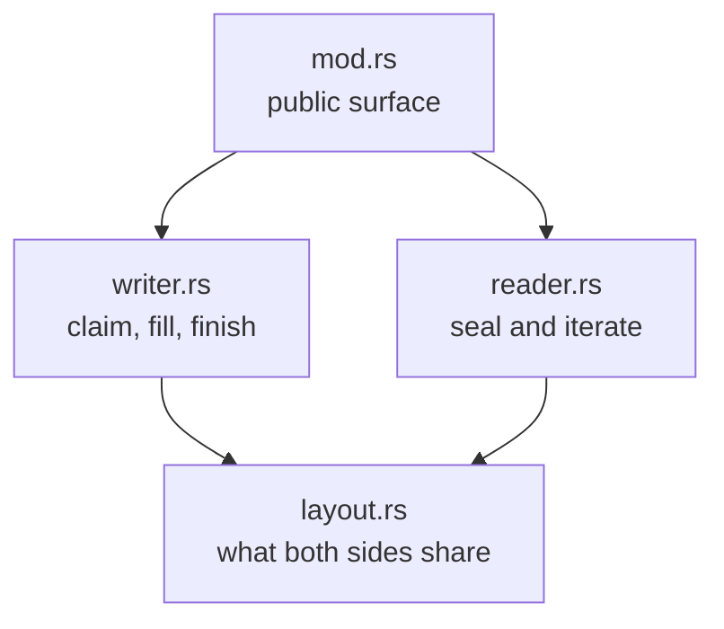

# shm_io: a crash-tolerant frame channel over shared memory

One shared-memory region. Many writer processes append variable-length records; one receiver collects them once, when the channel's lifetime ends.

Three requirements shape the design:

1. **A writer may die at any instruction.** That must not corrupt the channel or cost another writer its records.
2. **A writer may outlive the channel.** The receiver never waits for one.
3. **The receiver must know whether it got everything.** Either it gets every record writers published, or sealing fails and it gets none.

## The region

Any zero-initialized shared memory works. In practice it is a sparse file mapped into every participating process, so only the pages someone writes cost real memory.

```text
| counters | descriptor table (SLOTS slots) | payloads (the rest, grow up) |
```

One `repr(C)` struct holds two `AtomicU64` counters followed by one 8-byte descriptor slot per frame. The channel fixes the table length at compile time for both ends.

- The **claim counter** counts frames ever claimed. Bit 63 is the CLOSED gate: the receiver sets it when it seals, and so does any writer whose claim failed, which is how the receiver hears about a lost record.
- The **payload counter** counts payload bytes ever reserved.

Payloads take the rest of the mapping, so that struct's size is the whole geometry. Attaching checks one bound: the struct fits, and what remains is small enough for the descriptors' 32-bit offsets. The production channel takes ~67 million slots out of 4 GiB and leaves ~3.5 GiB of payload room, enough for 15 to 20 million records of a few hundred bytes. Payload space runs out first.

Where the table ends and payloads begin never moves. Claiming needs no retry loop, because a writer checks each counter against a fixed limit using the value `fetch_add` returned. Overshooting a limit costs nothing: no counter says where data is, since every committed descriptor carries its own offset and length.

## Writing a frame

1. **Claim.** Two `fetch_add`s reserve payload bytes and a slot. No retry loop, no lock. A claim that does not fit fails after the fact, and sets the CLOSED gate before the writer moves on.
2. **Fill.** The writer serializes into its payload span, which nobody else knows exists.
3. **Commit.** One store puts the payload's offset and length into the slot. Only the writer that claimed a slot ever writes it, so it needs no compare-and-swap. The receiver cannot see the frame before that store, and nobody touches the payload after it.

`FrameMut::finish` commits. What happens when it never runs is the heart of the design:

- **The process died,** mid-claim or mid-fill. The slot stays zero and the receiver ignores it. No cleanup code runs, because none exists.
- **The process abandoned the frame** and kept going. The slot stays zero and the receiver ignores that too, since it cannot tell the two apart.

So the channel asks one thing of its users: **publish a record before performing the action it describes.** A dead writer's missing record then describes an action that never happened, and a record refused after the seal describes one performed after the channel closed. The receiver drops both. A writer that records after acting loses records with nothing said. A writer that abandons a frame and acts anyway calls `ShmWriter::report_lost_record`.

## When the region fills up

A 4 GiB region holds tens of millions of records, but not endless ones. When a claim asks for more room than the payload area or the table has left, it fails. The writer skips that record and carries on, because recording must never stop the program doing the work.

The loss is not silent. The failed claim sets the CLOSED gate before it returns, and a receiver that finds that bit already set fails its seal and hands back nothing.

Setting the bit first matters for the same reason publishing before acting does. If the receiver's read misses the bit, the writer set it after the seal, so the skipped record describes an action performed after the channel closed. And a writer that died before setting it never performed its action.

Because the bit is also the gate, the first lost record closes the channel and every later claim is refused. Those records would only pile up in a result nobody can use.

A single frame holds at most `u32::MAX` bytes, since a descriptor cannot describe more. Such a claim is refused and reported the same way.

## Sealing and reading

Sealing swaps the CLOSED gate into the claim counter and reads the old value. That one operation draws the boundary and shuts the gate: claims at or before it are in, every later one fails. If the bit was already set, a record was lost or someone sealed earlier, and sealing fails here.

No slot is touched, so sealing a channel holding ten million frames costs what sealing an empty one costs.

`ShmReader` owns the mapping and lends out one `&[u8]` per committed span, straight from shared memory. It reads the table when asked, so a writer still filling a frame when the boundary was drawn may appear in a later read and not an earlier one. Dropping the reader releases the mapping.

## Why this is sound

- Finding frames never reads payload bytes, and every slot sits at a fixed place, so a half-written payload cannot be mistaken for metadata.
- The receiver reaches a payload only through its committed descriptor. The writer commits with `Release` and the receiver loads with `Acquire`, so a descriptor the receiver sees brings its payload bytes along.
- One writer owns each slot and writes it once. A slot goes from zero to committed and stops.
- No counter has to be exact. Both only climb, refused claims leave their increments behind, and the receiver clamps its snapshot to the table length, so a scribbled counter costs it a walk over empty slots.
- The receiver builds its borrows from a committed descriptor without re-checking it. That trusts the other processes to follow the protocol; one that scribbles random memory is outside the model. It is also why the receiver reads frames straight out of shared memory, with no copies and no checksums.

## Deployment note

On Linux, the first touch of the sparse backing file costs a millisecond or two on journalling filesystems. It is the fault path rather than block allocation, so `fallocate` does not help. Whichever side touches the region first pays it, once per channel. A filesystem that does not journal avoids it.

## Files

| File        | Role                                                                                                          |
| ----------- | ------------------------------------------------------------------------------------------------------------- |
| `mod.rs`    | Public surface, and integration tests over a mocked region (`cargo miri test -p fspy_shared shm_io`).         |
| `writer.rs` | Claim a frame, fill it, finish it.                                                                            |
| `reader.rs` | Seal the channel, then iterate committed frames, with the argument for why its borrows hold.                  |
| `layout.rs` | What both sides share: the `repr(C)` shape, the descriptor format, the ordering contract, and `MappedLayout`. |



Each file needs only the ones below it, so read from `layout.rs` upward.
