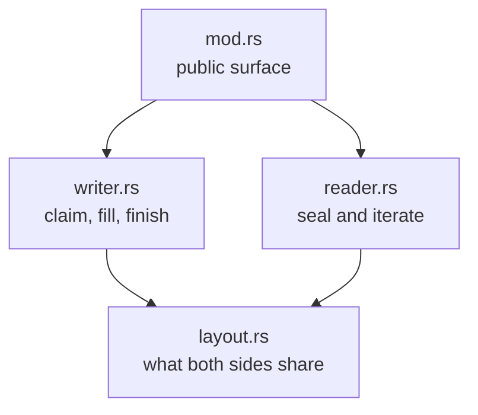

# shm_io: a crash-tolerant frame channel over shared memory

One shared-memory region. Many writer processes append variable-length
records; one receiver collects them once, when the channel's lifetime ends.

Three requirements shaped everything here:

1. **A writer may die at any instruction** — killed, crashed, anywhere.
   This must never corrupt the channel or lose another writer's records.
2. **A writer may outlive the channel.** The receiver must never wait for
   writers; sealing is immediate.
3. **The receiver must know whether it got everything.** Either the frames
   hold every record writers published, or sealing fails and hands back
   nothing. Never a silently short result.

Simpler designs fail these. A lock that writers hold while active proves
"no writers left" only as long as every writer manages the lock correctly —
one process dropping it early lets the reader race live writes and parse
half-written bytes. Waiting for writers to finish hangs forever on a
writer that never exits. Counting active writers breaks because a killed
process never decrements the count.

## The region

The region is any zero-initialized shared memory — in practice a sparse
file mapped into every participating process. A sparse mapping is address
space, not memory: only pages that are actually written get backed.

```text
| counters | descriptor table (SLOTS slots) | payloads (the rest, grow up) |
```

The region starts with one `repr(C)` struct: two `AtomicU64` counters
followed by one 8-byte descriptor slot per frame. The table length is a compile-time constant the channel picks
once for both ends:

- the **claim counter** — how many frames were ever claimed. Bit 63 is
  the CLOSED gate, set by the receiver when it closes the channel — and
  by any writer whose claim failed, which is how the receiver learns
  that a record was lost.
- the **payload counter** — how many payload bytes were ever reserved.

The payload area is simply the rest of the mapping, so the whole
geometry reduces to one number — the struct's size — and attaching
checks a single bound: the struct must fit inside the mapping, leaving a
payload area the descriptors' 32-bit offsets can address. The production
channel uses ~67 million slots in a 4 GiB region; the ~3.5 GiB payload
area holds ~15–20 million records of a few hundred bytes, so payload
space runs out first.

The line between table space and payload space never moves. That is what
keeps claiming free of retry loops: each counter is checked against a
limit that never changes, using the value `fetch_add` returned, and
overshooting a limit is harmless because nothing ever locates data through
a counter — a committed descriptor carries its own offset and length.

## Writing a frame

Three steps:

1. **Claim.** Two `fetch_add`s — one reserves payload bytes, one reserves a
   slot. No retry loop, no lock. A claim that does not fit fails after the
   fact and sets the CLOSED gate before the writer moves on.
2. **Fill.** The writer serializes into its payload span. The span is
   exclusively its own; nobody else knows it exists yet.
3. **Commit.** One store puts a descriptor holding the payload's offset
   and length into the frame's slot. Only the writer that claimed the slot
   ever writes it, so no compare-and-swap is needed. Before the store the
   receiver cannot see the frame at all; after it, the frame is visible and
   its payload never changes again.

Committing is explicit (`FrameMut::finish`). What happens when it never
runs is the heart of the design:

- **The process died** — mid-claim, mid-fill, anywhere. The slot stays
  zero. The receiver ignores it. Nothing else is affected, and no cleanup
  code ever runs or is needed.
- **The process is alive but abandoned the frame** (dropped it without
  finishing). The slot stays zero and the receiver ignores it, exactly as if
  the writer had died there — the receiver cannot tell the two apart. So a
  writer that gives up on a frame and then performs the action anyway has to
  say so, with `ShmWriter::report_lost_record`.

These rules assume one thing about how the channel is used: **a writer
publishes a record before performing the action the record describes.**
Then a dead writer's missing record describes an action that never
happened, and a record refused after the seal describes an action performed
after the channel closed — both safe to ignore. A writer that records
_after_ acting steps outside this rule and loses records silently. One that
gives up on a frame and acts anyway must report the loss, which closes the
channel and fails its seal.

## When the region fills up

The region is large — the payload area of a 4 GiB region holds tens of
millions of records — but it is not endless. When a claim asks for more
room than is left, in the payload area or in the table, the claim fails.
The writer skips that one record and carries on: recording must never
stop or crash the program doing the work.

The loss is not silent. Before moving on, the failed claim sets the
CLOSED gate — the same bit the receiver sets when it seals. When the
receiver seals the channel it reads the bit once; if it was already set,
sealing fails and no frames are handed out at all.

Setting the bit before moving on matters for the same reason committing
a record before acting does. If the receiver's read misses the bit, the
bit was set after the seal — so the skipped record describes an action
performed after the channel closed, which the receiver never promised to
include. And a writer that dies before setting the bit never performed
its action, so nothing was actually lost.

Because the bit is also the gate, the first lost record closes the
channel: every later claim is refused. That refusal costs nothing — the
result is already doomed, so any further records would only be added to
something nobody can use.

One more limit: a single frame holds at most `u32::MAX` bytes, because a
descriptor cannot describe more. Such a claim is refused — and reported —
the same way.

## Sealing and reading

The receiver seals the channel once:

1. **Snapshot** the claim counter with a plain load. This is the boundary:
   claims at or before it are in, later ones are not. If the CLOSED bit is
   already set, a record was lost or someone sealed earlier, and the seal
   fails right here — a partial set of frames is never handed out.
2. **Gate** further claims by setting the CLOSED bit, so stragglers stop.

That is the whole of it: one load and one bit. No slot is touched, so
sealing costs the same whether the channel holds one frame or ten million.

The result, `ShmReader`, owns the mapping and lends out one `&[u8]` per
committed span, straight from shared memory — no copy. It reads the table
when asked, so a writer that was still filling a frame when the line was
drawn may show up in a later read and not an earlier one. The borrows are
sound because a committed span is never written again and is disjoint from
everything a live straggler may still touch. The mapping is released when
the reader is dropped.

```text
                       writer finishes the frame
CLAIMED (slot 0) -------------------------------> COMMITTED (readable)
       |
       +-- writer dies or gives the claim up ---> stays zero (ignored)
```

## Why this is sound, in one list

- Finding frames never involves reading payload bytes; every slot has a
  fixed place. A half-written payload can never be mistaken for metadata.
- A payload is reachable only through its committed descriptor. The commit
  is a `Release` write and the receiver's load is an `Acquire` read, so a
  descriptor the receiver sees brings its payload bytes with it.
- One writer owns each slot and writes it once, so a slot goes from zero to
  committed and never changes again.
- No counter has to be exact: a refused claim sets the CLOSED gate —
  failing the seal and refusing every later claim —
  and leaves its increments where they are. Both counters only ever climb,
  which costs nothing: neither one says where data is. The receiver still
  clamps its snapshot to the fixed capacities, so even a scribbled counter
  just means walking extra empty slots.
- A committed descriptor names the span its writer reserved and checked,
  so the receiver builds its borrows from it without re-checking. That
  trusts the other processes to follow the protocol — one that scribbles
  random memory is outside the model — and it is why the receiver can read
  frames straight out of shared memory, with no copies and no checksums.

## Performance notes

- Claiming is two atomic adds; committing is one store. Nothing retries,
  and no operation on the write path is a read-modify-write of a slot.
- Sealing is one load and one bit, whatever the channel holds. Nothing is
  copied and nothing is allocated — the whole module is allocation-free;
  the reader reads the table to iterate.
- On Linux, the first touch of the sparse backing file can cost
  milliseconds on journalling filesystems (it is the fault path, not block
  allocation — `fallocate` does not help). Creators should run `pre_fault`
  off any latency-sensitive path — for example on a background thread,
  concurrently with spawning the first writer. Windows and macOS fault
  cheaply and skip this.

## Files

| File        | Role                                                                                                                                                                                                                             |
| ----------- | -------------------------------------------------------------------------------------------------------------------------------------------------------------------------------------------------------------------------------- |
| `mod.rs`    | Public surface (`ShmWriter`, `ShmReader`), the protocol overview docs, and the integration tests — they run against a mocked region and are miri-clean (`cargo miri test -p fspy_shared shm_io`).                                |
| `writer.rs` | The writer side: claim a frame, fill it, finish it.                                                                                                                                                                              |
| `reader.rs` | The reader side: seal the channel, then iterate the committed frames — with the argument for why its borrows are sound.                                                                                                          |
| `layout.rs` | Only what both sides share: the region's `repr(C)` shape — counters, then slots — the descriptor format, and `MappedLayout`, that shape bound to one concrete mapping. Encoding lives with the writer, decoding with the reader. |

Arrows point at what a file depends on:



Read from the bottom up — `layout.rs`, then `writer.rs` and `reader.rs`,
then `mod.rs` — and each file only needs the ones below it.
