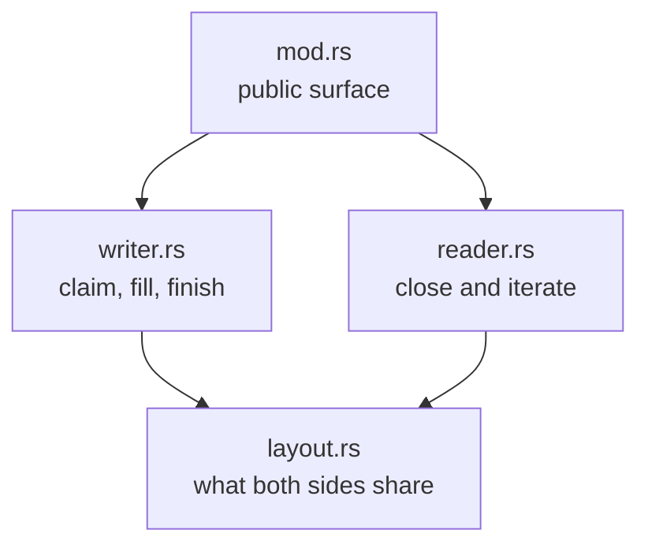

# shm_io: a crash-tolerant frame channel over shared memory

One shared-memory region. Many writer processes append variable-length
records; one receiver collects them once, when the channel's lifetime ends.

Three requirements shaped everything here:

1. **A writer may die at any instruction** — killed, crashed, anywhere.
   This must never corrupt the channel or lose another writer's records.
2. **A writer may outlive the channel.** The receiver must never wait for
   writers; closing is immediate.
3. **The receiver must know whether it got everything.** Either the frames
   hold every record writers published, or they are flagged incomplete.
   Never a silently short result.

Simpler designs fail these. A lock that writers hold while active proves
"no writers left" only as long as every writer manages the lock correctly —
one process dropping it early lets the reader race live writes and parse
half-written bytes. Waiting for writers to finish hangs forever on a
writer that never exits. Counting active writers breaks because a killed
process never decrements the count.

## The region

The region is any zero-initialized shared memory — in practice a sparse
file mapped into every participating process. A sparse mapping is address
space, not memory: only pages that are actually written get backed.

```text
| header (64 B) | descriptor table (1/8 of the region) | payloads (the rest, grow up) |
```

The header is a `repr(C)` struct of two `AtomicU64` counters, which only
ever count up:

- the **claim counter** — how many frames were ever claimed. Bit 63 is
  the CLOSED gate, set by the receiver when it closes the channel — and
  by any writer whose claim failed, which is how the receiver learns
  that a record was lost.
- the **payload counter** — how many payload bytes were ever reserved.

The table has one 8-byte slot per frame — an eighth of the region. Every
bound is derived from the mapping length alone, so the region is
self-describing: writers and the receiver compute the same layout from the
size of the file they mapped, with nothing else to agree on. Supported
lengths are multiples of 8 bytes between 1 KiB and 4 GiB — the creator
rounds its requested size up into that set, so the layout rules never
meet a degenerate region. For a 4 GiB
region that is ~67 million slots; the ~3.5 GiB payload region fits ~15–20
million records of a few hundred bytes, so payload space runs out first.

The line between table space and payload space never moves. That is what
keeps claiming free of retry loops: each counter is checked against a
limit that never changes, using the value `fetch_add` returned, and
overshooting a limit is harmless because nothing ever locates data through
a counter — a committed descriptor carries its own offset and length.

## Writing a frame

Three steps:

1. **Claim.** Two `fetch_add`s — one reserves payload bytes, one reserves a
   slot. No retry loop, no lock. A claim that does not fit fails after the
   fact and sets the CLOSED gate before the writer moves on.
2. **Fill.** The writer serializes into its payload span. The span is
   exclusively its own; nobody else knows it exists yet.
3. **Commit.** One compare-and-swap flips the frame's slot from zero to a
   descriptor holding the payload's offset and length. Before this swap the
   receiver cannot see the frame at all; after it, the frame is visible and
   its payload never changes again.

Committing is explicit (`FrameMut::finish`). What happens when it never
runs is the heart of the design:

- **The process died** — mid-claim, mid-fill, anywhere. The slot stays
  zero. The receiver ignores it. Nothing else is affected, and no cleanup
  code ever runs or is needed.
- **The process is alive but abandoned the frame** (dropped it without
  finishing). Same thing: the slot stays zero and the receiver ignores it,
  exactly as if the writer had died there.

These rules assume one thing about how the channel is used: **a writer
publishes a record before performing the action the record describes.**
Then a dead writer's missing record describes an action that never
happened, and a record refused after close describes an action performed
after the channel closed — both safe to ignore. A writer that records
_after_ acting, or that abandons a frame and performs the action anyway,
steps outside this rule and loses records silently.

## When the region fills up

The region is large — the payload area of a 4 GiB region holds tens of
millions of records — but it is not endless. When a claim asks for more
room than is left, in the payload area or in the table, the claim fails.
The writer skips that one record and carries on: recording must never
stop or crash the program doing the work.

The loss is not silent. Before moving on, the failed claim sets the
CLOSED gate — the same bit the receiver sets when it closes. When the
receiver closes the channel it reads the bit once; if it was already
set, `is_complete` returns false, and a reader that needs the full
picture knows to throw the result away.

Setting the bit before moving on matters for the same reason committing
a record before acting does. If the receiver's read misses the bit, the
bit was set after close — so the skipped record describes an action
performed after the channel closed, which the receiver never promised to
include. And a writer that dies before setting the bit never performed
its action, so nothing was actually lost.

Because the bit is also the gate, the first lost record closes the
channel: every later claim is refused. That refusal costs nothing —
`is_complete` is already false, so the result must be thrown away, and
any further records would ride a result nobody can use.

One more limit: a single frame holds at most 2 GiB, because a descriptor
cannot describe more. Such a claim is refused — and reported — the same
way.

## Closing and reading

The receiver closes once:

1. **Snapshot** the claim counter with a plain load. This is the boundary:
   claims at or before it are in, later ones are not.
2. **Gate** further claims by setting the CLOSED bit, so stragglers stop.
3. **Freeze** every slot in the snapshot: a compare-and-swap flips zero to
   ABORTED. If the slot was already committed, the swap fails and the frame
   is kept. Exactly one side wins each slot, and either way the slot
   never changes again.
4. **Validate** each committed descriptor's bounds. A descriptor no correct
   writer could produce fails the whole channel — never a panic, never an
   out-of-bounds read.

The result, `ShmReader`, owns the mapping and lends out one `&[u8]` per
committed span, straight from shared memory — no copy. The borrows are
sound because a committed span is never written again and is disjoint from
everything a live straggler may still touch. The mapping is released when
the reader is dropped.

```text
                         writer's commit CAS wins
                    +------------------------------> COMMITTED (readable)
CLAIMED (slot 0) ---+
                    +------------------------------> ABORTED (ignored)
                         receiver's freeze CAS wins
```

## Why this is sound, in one list

- Finding frames never involves reading payload bytes; every slot has a
  fixed place. A half-written payload can never be mistaken for metadata.
- A payload is reachable only through its committed descriptor. The commit
  is a `Release` write and the receiver's failed freeze is an `Acquire`
  read, so an observed descriptor implies fully visible payload bytes.
- Once a slot is committed or aborted, nothing ever changes it again.
- Counters only grow. The receiver clamps them to the fixed capacities —
  an inflated counter degrades into extra aborted slots, not corruption.
  Loss is reported through the CLOSED gate: a failed claim sets it before
  the writer carries on, which both marks the result incomplete and
  refuses every later claim.
- The bounds checks on descriptors are what make the `unsafe` reference
  construction correct: whether the receiver stays memory-safe never
  depends on another process behaving.
- Whether the bytes are _right_ does trust the other processes to follow
  the protocol — one that scribbles random memory is outside the model.
  That trust is why the receiver can read frames straight out of shared
  memory, with no copies and no checksums.

## Performance notes

- Claiming is two atomic adds; committing is one CAS. Nothing retries.
- Closing costs one pass over the claimed slots. Nothing is copied and
  nothing is allocated — the whole module is allocation-free; the reader
  re-reads the frozen table to iterate.
- On Linux, the first touch of the sparse backing file can cost
  milliseconds on journalling filesystems (it is the fault path, not block
  allocation — `fallocate` does not help). Creators should run `pre_fault`
  off any latency-sensitive path — for example on a background thread,
  concurrently with spawning the first writer. Windows and macOS fault
  cheaply and skip this.

## Files

| File        | Role                                                                                                                                                                                              |
| ----------- | ------------------------------------------------------------------------------------------------------------------------------------------------------------------------------------------------- |
| `mod.rs`    | Public surface (`ShmWriter`, `ShmReader`), the protocol overview docs, and the integration tests — they run against a mocked region and are miri-clean (`cargo miri test -p fspy_shared shm_io`). |
| `writer.rs` | The writer side: claim a frame, fill it, finish it.                                                                                                                                               |
| `reader.rs` | The reader side: close the channel, then iterate the committed frames — with the argument for why its borrows are sound.                                                                          |
| `layout.rs` | Everything both sides share: the region's shape and sizing math, the header, the descriptor codec, and `MappedLayout` — the shape bound to one concrete mapping.                                  |

Arrows point at what a file depends on:



Read from the bottom up — `layout.rs`, then `writer.rs` and `reader.rs`,
then `mod.rs` — and each file only needs the ones below it.
