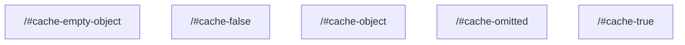

# task graph



## `<workspace>/#cache-empty-object`

```json
{
  "task_display": {
    "package_name": "test",
    "task_name": "cache-empty-object",
    "package_path": "<workspace>/"
  },
  "resolved_config": {
    "commands": [
      "echo build"
    ],
    "resolved_options": {
      "cwd": "<workspace>/",
      "cache_config": {
        "remote_cache_allowed": true,
        "env_config": {
          "fingerprinted_envs": [],
          "untracked_env": [
            "<default untracked envs>"
          ]
        },
        "input_config": {
          "includes_auto": true,
          "positive_globs": [],
          "negative_globs": []
        },
        "output_config": {
          "includes_auto": true,
          "positive_globs": [],
          "negative_globs": []
        }
      }
    }
  },
  "source": "TaskConfig"
}
```

## `<workspace>/#cache-false`

```json
{
  "task_display": {
    "package_name": "test",
    "task_name": "cache-false",
    "package_path": "<workspace>/"
  },
  "resolved_config": {
    "commands": [
      "echo build"
    ],
    "resolved_options": {
      "cwd": "<workspace>/",
      "cache_config": null
    }
  },
  "source": "TaskConfig"
}
```

## `<workspace>/#cache-object`

```json
{
  "task_display": {
    "package_name": "test",
    "task_name": "cache-object",
    "package_path": "<workspace>/"
  },
  "resolved_config": {
    "commands": [
      "echo build"
    ],
    "resolved_options": {
      "cwd": "<workspace>/",
      "cache_config": {
        "remote_cache_allowed": true,
        "env_config": {
          "fingerprinted_envs": [
            "MY_ENV"
          ],
          "untracked_env": [
            "MY_UNTRACKED",
            "<default untracked envs>"
          ]
        },
        "input_config": {
          "includes_auto": false,
          "positive_globs": [
            "src/**"
          ],
          "negative_globs": [
            "src/**/*.test.ts"
          ]
        },
        "output_config": {
          "includes_auto": false,
          "positive_globs": [
            "dist/**"
          ],
          "negative_globs": []
        }
      }
    }
  },
  "source": "TaskConfig"
}
```

## `<workspace>/#cache-omitted`

```json
{
  "task_display": {
    "package_name": "test",
    "task_name": "cache-omitted",
    "package_path": "<workspace>/"
  },
  "resolved_config": {
    "commands": [
      "echo build"
    ],
    "resolved_options": {
      "cwd": "<workspace>/",
      "cache_config": {
        "remote_cache_allowed": true,
        "env_config": {
          "fingerprinted_envs": [],
          "untracked_env": [
            "<default untracked envs>"
          ]
        },
        "input_config": {
          "includes_auto": true,
          "positive_globs": [],
          "negative_globs": []
        },
        "output_config": {
          "includes_auto": true,
          "positive_globs": [],
          "negative_globs": []
        }
      }
    }
  },
  "source": "TaskConfig"
}
```

## `<workspace>/#cache-true`

```json
{
  "task_display": {
    "package_name": "test",
    "task_name": "cache-true",
    "package_path": "<workspace>/"
  },
  "resolved_config": {
    "commands": [
      "echo build"
    ],
    "resolved_options": {
      "cwd": "<workspace>/",
      "cache_config": {
        "remote_cache_allowed": true,
        "env_config": {
          "fingerprinted_envs": [],
          "untracked_env": [
            "<default untracked envs>"
          ]
        },
        "input_config": {
          "includes_auto": true,
          "positive_globs": [],
          "negative_globs": []
        },
        "output_config": {
          "includes_auto": true,
          "positive_globs": [],
          "negative_globs": []
        }
      }
    }
  },
  "source": "TaskConfig"
}
```

