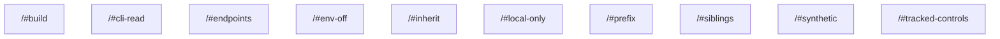

# task graph



## `<workspace>/#build`

```json
{
  "task_display": {
    "package_name": "@test/remote-cache-config",
    "task_name": "build",
    "package_path": "<workspace>/"
  },
  "resolved_config": {
    "commands": [
      "vtt print-file package.json"
    ],
    "resolved_options": {
      "cwd": "<workspace>/",
      "cache_config": {
        "remote_cache": true,
        "env_config": {
          "fingerprinted_envs": [
            "!PATH",
            "*"
          ],
          "untracked_env": [
            "<default untracked envs>"
          ]
        },
        "input_config": {
          "includes_auto": true,
          "positive_globs": [],
          "negative_globs": []
        },
        "output_config": {
          "includes_auto": true,
          "positive_globs": [],
          "negative_globs": []
        }
      }
    }
  },
  "source": "TaskConfig"
}
```

## `<workspace>/#cli-read`

```json
{
  "task_display": {
    "package_name": "@test/remote-cache-config",
    "task_name": "cli-read",
    "package_path": "<workspace>/"
  },
  "resolved_config": {
    "commands": [
      "VP_REMOTE_CACHE=off vt run --remote-cache=read build"
    ],
    "resolved_options": {
      "cwd": "<workspace>/",
      "cache_config": {
        "remote_cache": true,
        "env_config": {
          "fingerprinted_envs": [],
          "untracked_env": [
            "<default untracked envs>"
          ]
        },
        "input_config": {
          "includes_auto": true,
          "positive_globs": [],
          "negative_globs": []
        },
        "output_config": {
          "includes_auto": true,
          "positive_globs": [],
          "negative_globs": []
        }
      }
    }
  },
  "source": "PackageJsonScript"
}
```

## `<workspace>/#endpoints`

```json
{
  "task_display": {
    "package_name": "@test/remote-cache-config",
    "task_name": "endpoints",
    "package_path": "<workspace>/"
  },
  "resolved_config": {
    "commands": [
      "VP_REMOTE_CACHE_URL=https://other.example/projects/nested vt run build && vt run build"
    ],
    "resolved_options": {
      "cwd": "<workspace>/",
      "cache_config": {
        "remote_cache": true,
        "env_config": {
          "fingerprinted_envs": [],
          "untracked_env": [
            "<default untracked envs>"
          ]
        },
        "input_config": {
          "includes_auto": true,
          "positive_globs": [],
          "negative_globs": []
        },
        "output_config": {
          "includes_auto": true,
          "positive_globs": [],
          "negative_globs": []
        }
      }
    }
  },
  "source": "PackageJsonScript"
}
```

## `<workspace>/#env-off`

```json
{
  "task_display": {
    "package_name": "@test/remote-cache-config",
    "task_name": "env-off",
    "package_path": "<workspace>/"
  },
  "resolved_config": {
    "commands": [
      "VP_REMOTE_CACHE=off vt run build"
    ],
    "resolved_options": {
      "cwd": "<workspace>/",
      "cache_config": {
        "remote_cache": true,
        "env_config": {
          "fingerprinted_envs": [],
          "untracked_env": [
            "<default untracked envs>"
          ]
        },
        "input_config": {
          "includes_auto": true,
          "positive_globs": [],
          "negative_globs": []
        },
        "output_config": {
          "includes_auto": true,
          "positive_globs": [],
          "negative_globs": []
        }
      }
    }
  },
  "source": "PackageJsonScript"
}
```

## `<workspace>/#inherit`

```json
{
  "task_display": {
    "package_name": "@test/remote-cache-config",
    "task_name": "inherit",
    "package_path": "<workspace>/"
  },
  "resolved_config": {
    "commands": [
      "vt run build"
    ],
    "resolved_options": {
      "cwd": "<workspace>/",
      "cache_config": {
        "remote_cache": true,
        "env_config": {
          "fingerprinted_envs": [],
          "untracked_env": [
            "<default untracked envs>"
          ]
        },
        "input_config": {
          "includes_auto": true,
          "positive_globs": [],
          "negative_globs": []
        },
        "output_config": {
          "includes_auto": true,
          "positive_globs": [],
          "negative_globs": []
        }
      }
    }
  },
  "source": "PackageJsonScript"
}
```

## `<workspace>/#local-only`

```json
{
  "task_display": {
    "package_name": "@test/remote-cache-config",
    "task_name": "local-only",
    "package_path": "<workspace>/"
  },
  "resolved_config": {
    "commands": [
      "vtt print-file package.json"
    ],
    "resolved_options": {
      "cwd": "<workspace>/",
      "cache_config": {
        "remote_cache": false,
        "env_config": {
          "fingerprinted_envs": [],
          "untracked_env": [
            "<default untracked envs>"
          ]
        },
        "input_config": {
          "includes_auto": true,
          "positive_globs": [],
          "negative_globs": []
        },
        "output_config": {
          "includes_auto": true,
          "positive_globs": [],
          "negative_globs": []
        }
      }
    }
  },
  "source": "TaskConfig"
}
```

## `<workspace>/#prefix`

```json
{
  "task_display": {
    "package_name": "@test/remote-cache-config",
    "task_name": "prefix",
    "package_path": "<workspace>/"
  },
  "resolved_config": {
    "commands": [
      "VP_REMOTE_CACHE=off VP_REMOTE_CACHE_URL=https://other.example vtt print-file package.json"
    ],
    "resolved_options": {
      "cwd": "<workspace>/",
      "cache_config": {
        "remote_cache": true,
        "env_config": {
          "fingerprinted_envs": [],
          "untracked_env": [
            "<default untracked envs>"
          ]
        },
        "input_config": {
          "includes_auto": true,
          "positive_globs": [],
          "negative_globs": []
        },
        "output_config": {
          "includes_auto": true,
          "positive_globs": [],
          "negative_globs": []
        }
      }
    }
  },
  "source": "PackageJsonScript"
}
```

## `<workspace>/#siblings`

```json
{
  "task_display": {
    "package_name": "@test/remote-cache-config",
    "task_name": "siblings",
    "package_path": "<workspace>/"
  },
  "resolved_config": {
    "commands": [
      "VP_REMOTE_CACHE=off vt run build && vt run build"
    ],
    "resolved_options": {
      "cwd": "<workspace>/",
      "cache_config": {
        "remote_cache": true,
        "env_config": {
          "fingerprinted_envs": [],
          "untracked_env": [
            "<default untracked envs>"
          ]
        },
        "input_config": {
          "includes_auto": true,
          "positive_globs": [],
          "negative_globs": []
        },
        "output_config": {
          "includes_auto": true,
          "positive_globs": [],
          "negative_globs": []
        }
      }
    }
  },
  "source": "PackageJsonScript"
}
```

## `<workspace>/#synthetic`

```json
{
  "task_display": {
    "package_name": "@test/remote-cache-config",
    "task_name": "synthetic",
    "package_path": "<workspace>/"
  },
  "resolved_config": {
    "commands": [
      "vt tool print-file package.json"
    ],
    "resolved_options": {
      "cwd": "<workspace>/",
      "cache_config": {
        "remote_cache": false,
        "env_config": {
          "fingerprinted_envs": [],
          "untracked_env": [
            "<default untracked envs>"
          ]
        },
        "input_config": {
          "includes_auto": true,
          "positive_globs": [],
          "negative_globs": []
        },
        "output_config": {
          "includes_auto": true,
          "positive_globs": [],
          "negative_globs": []
        }
      }
    }
  },
  "source": "TaskConfig"
}
```

## `<workspace>/#tracked-controls`

```json
{
  "task_display": {
    "package_name": "@test/remote-cache-config",
    "task_name": "tracked-controls",
    "package_path": "<workspace>/"
  },
  "resolved_config": {
    "commands": [
      "vtt print-file package.json"
    ],
    "resolved_options": {
      "cwd": "<workspace>/",
      "cache_config": {
        "remote_cache": true,
        "env_config": {
          "fingerprinted_envs": [
            "VP_REMOTE_CACHE",
            "VP_REMOTE_CACHE_URL"
          ],
          "untracked_env": [
            "VP_REMOTE_CACHE",
            "VP_REMOTE_CACHE_URL",
            "<default untracked envs>"
          ]
        },
        "input_config": {
          "includes_auto": true,
          "positive_globs": [],
          "negative_globs": []
        },
        "output_config": {
          "includes_auto": true,
          "positive_globs": [],
          "negative_globs": []
        }
      }
    }
  },
  "source": "TaskConfig"
}
```

