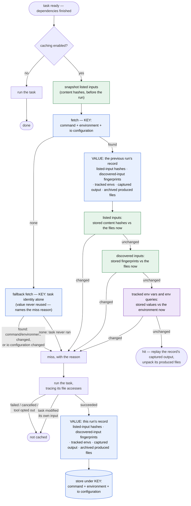

# A task run — fetch, validation, execution, store

**Green** = filesystem checks · **Purple** = environment checks · **Blue** = cache

```mermaid
flowchart TD
    Ready([task ready — dependencies finished]) --> CacheOn{caching enabled?}
    CacheOn -->|no| RunPlain["run the task"] --> DonePlain([done])
    CacheOn -->|yes| Snap["snapshot listed inputs<br/>(content hashes, before the run)"]

    Snap --> Fetch["fetch — KEY:<br/>command + environment + io configuration"]
    Fetch -->|found| Val["VALUE: the previous run's record<br/>listed-input hashes · discovered-input fingerprints<br/>· tracked envs · captured output · archived produced files"]
    Fetch -->|none| Fetch2["fallback fetch — KEY: task identity alone<br/>(value never reused — names the miss reason)"]
    Fetch2 -->|"found: command/environment changed,<br/>or io configuration changed"| Miss
    Fetch2 -->|"none: task never ran"| Miss

    Val --> V1["listed inputs:<br/>stored content hashes vs the files now"]
    V1 -->|changed| Miss
    V1 -->|unchanged| V2["discovered inputs:<br/>stored fingerprints vs the files now"]
    V2 -->|changed| Miss
    V2 -->|unchanged| V3["tracked env vars and env queries:<br/>stored values vs the environment now"]
    V3 -->|changed| Miss
    V3 -->|unchanged| Hit([hit — replay the record's captured output,<br/>unpack its produced files])

    Miss["miss, with the reason"] --> Run["run the task,<br/>tracing its file accesses"]
    Run -->|"failed / cancelled /<br/>tool opted out"| NC([not cached])
    Run -->|"task modified<br/>its own input"| NC
    Run -->|succeeded| Rec["VALUE: this run's record<br/>listed-input hashes · discovered-input fingerprints<br/>· tracked envs · captured output · archived produced files"]
    Rec --> Store[("store under KEY:<br/>command + environment + io configuration")]

    classDef fs fill:#e6f4ea,stroke:#137333,color:#111
    classDef env fill:#efe6fa,stroke:#6b21a8,color:#111
    classDef tier fill:#e8f0fe,stroke:#1a56db,color:#111
    class Snap,V1,V2 fs
    class V3 env
    class Fetch,Fetch2,Val,Rec,Store tier
```
