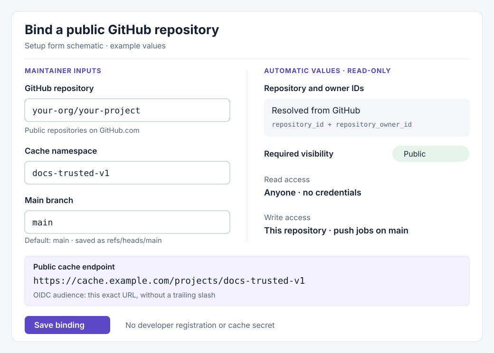
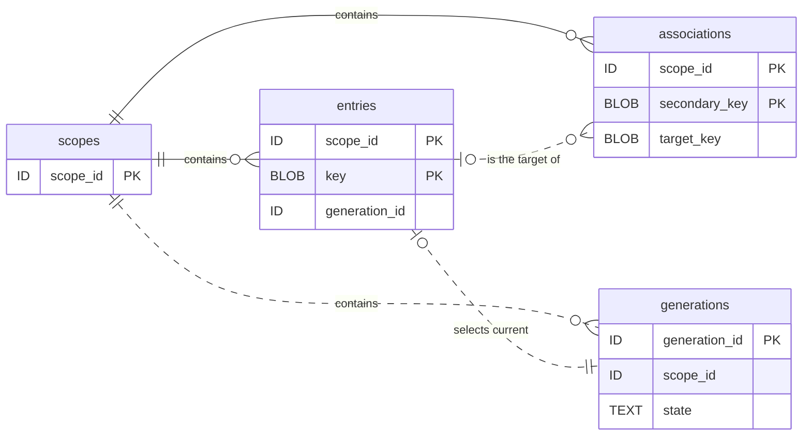
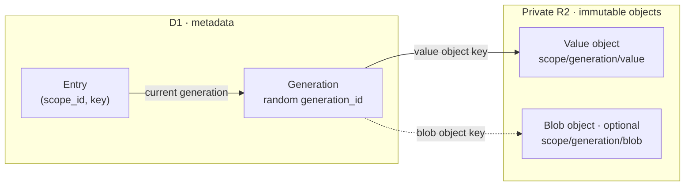

# RFC: Public remote cache for GitHub projects with `vp run`

Status: Draft design.

Updated: 2026-09-10. Repository baseline: `9a1d32cf`. API baseline: [PR #713](https://github.com/voidzero-dev/vite-task/pull/713), commit [`362f5bd9`](https://github.com/voidzero-dev/vite-task/blob/362f5bd91bb32806b512d3d9a5339ff435bf5f0a/docs/remote-cache-server-api.md). The API proposal remains a draft; check its final contract before implementation.

## 1. Motivation

Open-source maintainers should publish successful task results from the main branch through GitHub Actions. They should use a service in their own Cloudflare account. Developers and fork contributors should reuse these public results without login. The service needs no Vite+ hosted account or license service.

The client checks the local cache first. If a remote read fails, the client executes the task.

The current [docs deployment action](https://github.com/voidzero-dev/vite-plus/blob/ed1710f7aff8941436907a4d755d6b38c798ed41/.github/actions/deploy-docs/action.yml) transfers a whole task-cache directory through GitHub Actions Cache. A native remote cache can transfer one task's metadata and output blob. Compatible developer machines can reuse these results.

This RFC describes an implementation of PR #713 on Workers, D1, and R2. Reads need no authentication. Writes use GitHub Actions OpenID Connect (OIDC), which supplies signed tokens that identify jobs. The RFC sets operational defaults and estimates when an individual or small team can stay within Cloudflare's free allowances.

## 2. Contract and scope

PR #713 defines the HTTP contract. This RFC defines the Cloudflare storage, authorization, limits, deployment, and cleanup. A namespace is a project's cache scope at a configured endpoint. Version 1 requires public reads and write authorization for each registered repository. All three endpoints must keep namespace data separate. The client defines its fingerprint format and cache-validation policy.

| Area           | Decision                                                                                                |
| -------------- | ------------------------------------------------------------------------------------------------------- |
| Hosting        | Open-source TypeScript Worker, private R2 Standard bucket, D1 database, five-minute Cron Trigger        |
| Endpoints      | `POST /fetch`, `GET /blob/{blob_id}`, `POST /store`, relative to a configured namespace endpoint        |
| Data           | CBOR envelope; opaque binary keys and values; optional opaque blob                                      |
| Lookup         | Exact key first, then one secondary-key association                                                     |
| Store          | Replace the entry and secondary association together after object storage succeeds                      |
| Access control | Anonymous reads; GitHub OIDC writes restricted to the registered repository and main-branch push events |
| Transfer       | One multipart HTTP store request; internal R2 multipart upload for larger blobs                         |
| Client mode    | `--remote-cache` or `VP_REMOTE_CACHE` selects `off`, `read`, or `read-write`; defaults to `read` with an endpoint and `off` without one |
| Defaults       | Seven-day retention, 8 GB total R2 budget, 64 MiB maximum blob                                          |
| Failure        | Bounded waits; read failures become misses; upload failures warn without changing the task exit status |

The first delivery includes a template for self-deployment and a native Rust client adapter. The client must work on macOS, Linux, and Windows. Reuse across different operating systems or architectures requires a separate agreement about client compatibility.

This plan excludes remote execution, a hosted SaaS, anonymous writes, a web dashboard, and deduplication across projects. Version 2 covers private caches and Cloudflare One authorization.

## 3. Relationship to the current local cache

The current engine separates exact lookup from a task association that explains misses:

| Source evidence                                                                                                                                                               | Client integration consequence                                                         |
| ----------------------------------------------------------------------------------------------------------------------------------------------------------------------------- | -------------------------------------------------------------------------------------- |
| [`ExecutionCache::try_hit` and `CacheEntryKey`](../../crates/vt/src/session/cache/mod.rs) use the spawn fingerprint and resolved input/output configuration for exact lookup. | Construct `key` before execution. Input changes can replace the value at the same key. |
| [`ExecutionCacheKey`](../../crates/vt_plan/src/cache_metadata.rs) identifies the task for the diagnostic association.                                                         | Supply a corresponding `secondary_key`; a fallback result can explain what changed.    |
| [`PostRunFingerprint`](../../crates/vt/src/session/execute/fingerprint.rs) and explicit glob checks validate observed inputs.                                                 | An exact server response still needs local validation before reuse.                    |
| [`update_cache`](../../crates/vt/src/session/execute/cache_update.rs) rejects failed, cancelled, incompletely traced, or otherwise ineligible executions.                     | Apply the same eligibility checks before remote storage.                               |
| [`archive`](../../crates/vt/src/session/cache/archive.rs) and [`replay_cache_hit`](../../crates/vt/src/session/execute/mod.rs) handle output files and terminal replay.       | Import verified data through a bounded staging path before reporting a hit.            |

An exact response means that the server found identical key bytes. It does not prove that current input files, inferred dependencies, or tracked environment values match. In the current engine, fallback data explains a miss. The client does not reuse fallback outputs. Keep this distinction in the remote adapter. An exact entry that fails validation is a cache miss.

The client must define a portable, versioned encoding before it supports reuse across machines. An opaque field contains bytes that the Worker does not interpret. The encoding must preserve these observations:

- Negative file dependencies, which record that a file does not exist.
- Directory observations.
- Tracked environment queries.
- Explicit glob membership, which records the files that match each pattern.

The client must include schema, toolchain, and platform compatibility in its identity or validation data. PR #713 does not define this encoding. The Worker must not decode it. Local schema `v18` and a serialized SQLite directory do not define a portable wire format.

The client follows this sequence:

1. Validate the local cache. A local hit makes no remote request during `vp run`.
2. On a local miss, call `/fetch`.
3. Validate an exact response. Download its blob only if the result passes validation.
4. Restore the outputs. Save the result in local storage.

A fallback or `not_found` response leads to task execution. A successful eligible execution updates local storage, then queues its result for `/store` if uploads are enabled for that run. Cache hits do not trigger uploads.

## 4. HTTP API mapping

All paths are relative to an endpoint such as `https://cache.example.com/projects/docs-trusted-v1`. The endpoint includes the namespace. The examples describe fields in Concise Binary Object Representation (CBOR), a binary data format. `bytes` means a binary byte string. `string` means text. Nullable fields must remain present with CBOR `null` when they have no value.

### Fetch metadata

```text
POST {endpoint}/fetch
Content-Type: application/cbor

{ key: bytes, secondary_key: bytes }
```

Return HTTP `200`, `Content-Type: application/cbor`, with one of:

```text
{ kind: "exact", value: bytes, blob_id: string | null }
{ kind: "fallback", key: bytes, value: bytes, blob_id: string | null }
{ kind: "not_found" }
```

Check `key` first. If no live entry exists, resolve `secondary_key` to a stored key. Check that entry. Include the stored key only in the fallback variant. If neither resolves, return `not_found`. Fetch does not change entries or associations.

### Download a blob

```text
GET {endpoint}/blob/{blob_id}
```

Return HTTP `200`, `Content-Type: application/octet-stream`, with the raw blob. Return `404` if the blob is unavailable. The server generates an opaque blob ID within the endpoint's namespace. The ID is neither an R2 URL nor an authorization credential.

### Store an entry

```text
POST {endpoint}/store
Content-Type: multipart/form-data; boundary=...

metadata part (required), Content-Type: application/cbor:
  { key: bytes, secondary_key: bytes, value: bytes }

blob part (optional), Content-Type: application/octet-stream:
  raw blob bytes
```

Accept either part order. Return HTTP `200`, `Content-Type: application/cbor`:

```text
{ blob_id: string | null }
```

If the request omits the blob, return `null`. A present zero-byte blob receives a non-null ID. Its download has an empty body.

Each successful store replaces `entries[key]` and sets `associations[secondary_key] = key`. For example:

| Operation           | Entries afterward                               | Association afterward |
| ------------------- | ----------------------------------------------- | --------------------- |
| Store `(A, S, VA)`  | `A → VA`                                        | `S → A`               |
| Store `(B, S, VB)`  | `A → VA`, `B → VB`                              | `S → B`               |
| Fetch `(A, S)`      | Unchanged; returns exact `VA`                   | Still `S → B`         |
| Fetch `(C, S)`      | Unchanged; returns fallback key `B`, value `VB` | Still `S → B`         |
| Store `(A, T, VA2)` | `A → VA2`, `B → VB`                             | `S → B`, `T → A`      |

Other secondary keys that already point to `A` also resolve to `VA2`. A change to `S` does not evict entry `A`.

### Errors

API errors use `Content-Type: text/plain; charset=utf-8`. Clients use the status code, not the human-readable message, to classify them.

| Status | Meaning                                                                  |
| ------ | ------------------------------------------------------------------------ |
| `400`  | Malformed request or invalid field types                                 |
| `404`  | Blob unavailable                                                         |
| `413`  | Request exceeds configured size limits                                   |
| `500`  | Operation could not complete                                             |
| `503`  | Service temporarily unavailable, including exhausted application budgets |

If metadata is absent, return `200` with `not_found`. Version 1 reads require no credentials. For `/store`, this deployment adds these errors:

- `401`: The JSON Web Token (JWT) is missing, invalid, or expired.
- `403`: The verified JWT fails the namespace's write policy.
- `503`: The Worker cannot establish authorization because D1 or required signing keys are unavailable.

Keep these errors generic. Use plain text. PR #713 does not define authentication. Rate limiting can return `429` with `Retry-After`. Cloudflare can reject requests before the Worker runs. Clients must handle error bodies outside the protocol without authentication redirects.

## 5. Public reads, GitHub OIDC writes, and cache uploads

Version 1 serves public cache data for open-source repositories on GitHub.com. Anyone can call `/fetch` and `/blob/{blob_id}` without credentials. Only an authorized GitHub Actions job can call `/store`. Developers use the checked-in endpoint without login, secrets, or individual permission setup. Version 2 covers private projects with Cloudflare One authorization.

### Client configuration and remote cache modes

```ts
export default {
  run: {
    remoteCache: {
      url: 'https://cache.example.com/projects/docs-trusted-v1',
    },
  },
};
```

Use `--remote-cache` to select a mode for one invocation, or set `VP_REMOTE_CACHE` to configure all `vp run` commands in an environment. Both accept the same values:

| Command | Environment variable | Remote reads | Uploads |
| --- | --- | --- | --- |
| `vp run build --remote-cache=off` | `VP_REMOTE_CACHE=off` | Disabled | Disabled |
| `vp run build --remote-cache=read` | `VP_REMOTE_CACHE=read` | Enabled | Disabled |
| `vp run build --remote-cache=read-write` | `VP_REMOTE_CACHE=read-write` | Enabled | Enabled |

The command-line option takes precedence over `VP_REMOTE_CACHE`. If neither is set, use `read` when an endpoint is configured; otherwise, use `off`. The mode leaves local caching unchanged.

Use `VP_REMOTE_CACHE_URL` to override the endpoint on a host. Without an endpoint, the client makes no remote requests. Selecting `read` or `read-write` through the command-line option or `VP_REMOTE_CACHE` without an endpoint reports a configuration error before execution.

Task-level `remoteCache: false` excludes remote reads and uploads but retains local caching. `cache: false`, `--no-cache`, and tool-requested cache disabling also prevent uploads. The remote cache mode does not override these exclusions.

Version 1 uploads require GitHub Actions OIDC authorization for a main-branch push job. Enable uploads in that job with `VP_REMOTE_CACHE=read-write` or `--remote-cache=read-write`.

### Upload lifecycle

In `read-write` mode, queue one `/store` request after each successful eligible task saves its result locally. Upload only results generated by the current invocation. Cache hits do not trigger uploads.

Upload in the background with bounded concurrency so dependent tasks can start without waiting for network transfers. A successful task's result remains eligible even if another task fails. Before exiting after task execution, wait for pending uploads within a bounded deadline.

### One-time repository binding

The operator binds a public repository during deployment. This form illustrates the setup inputs and automatic values:



Setup saves both immutable IDs, the branch ref, and the audience in the server policy. The audience identifies the token's intended recipient. The client derives the same audience from its configured endpoint, without a trailing slash.

After a repository transfer, review the binding. Update the owner ID. After an endpoint alias or namespace change, update the policy.

### GitHub Actions token acquisition

The publishing job grants `permissions: id-token: write`. This permission lets the job request an OIDC token. The Worker decides whether the token grants write access. The native client uses GitHub's `ACTIONS_ID_TOKEN_REQUEST_URL` and `ACTIONS_ID_TOKEN_REQUEST_TOKEN` to request a token with the namespace audience. See GitHub's [OIDC workflow configuration](https://docs.github.com/en/actions/how-tos/secure-your-work/security-harden-deployments/oidc-in-cloud-providers).

`vp run` requests the token only when uploads are enabled and a newly generated result is ready to upload. Send the returned JWT to `/store` as `Authorization: Bearer <github_oidc_token>`. The Worker verifies it directly, without a custom endpoint for token exchange.

Keep the JWT in process memory. Reuse it only while it remains valid for the same audience. Obtain a fresh token before expiry. Send the runner's request token only to GitHub's token endpoint. Never send that request token to the cache Worker. If GitHub OIDC is unavailable, report one warning and stop upload attempts for the invocation without changing the task exit status.

Do not forward either token across redirects. Do not write either token to config, command arguments, output, or the cache. Remove the OIDC request variables and remote-cache controls from these locations, including through wildcard environment selection:

- Environments of task child processes.
- Fingerprints.
- Runner-aware environment APIs.
- Serialized plans.
- Debug output.

These controls do not isolate a privileged job from other code that runs as the same OS user. Publication jobs execute trusted code from the main branch.

### Worker write policy

Authorize only registered namespaces. Use the stored repository and owner IDs; names serve as display data. Do not let a token claim a namespace. Use the stored audience, never the request's `Host` header.

Verify the JWT signature before the Worker reads a store body or reserves quota. Use a maintained library such as [`jose`](https://github.com/panva/jose), which supports Workers and remote JSON Web Key Sets (JWKS). A JWKS supplies public keys for signature verification.

Use GitHub's fixed [OIDC issuer metadata](https://token.actions.githubusercontent.com/.well-known/openid-configuration) and HTTPS JWKS endpoint. Allow only its supported signing algorithm (`RS256` initially). Reject `none`, symmetric algorithms, key URLs from tokens, and claims without signature verification.

Set limits for token size, JWKS response size, fetch time, cache lifetime, and refresh frequency. Unknown key IDs must not trigger unlimited outbound requests. Return `503` if key retrieval fails and the cache has no usable key. Do not skip signature verification.

After signature verification, check these signed claims against the enabled namespace policy:

| Claim                   | Required value                                      |
| ----------------------- | --------------------------------------------------- |
| `iss`                   | `https://token.actions.githubusercontent.com`       |
| `aud`                   | Exact configured namespace endpoint                 |
| `repository_id`         | Namespace's registered repository ID                |
| `repository_owner_id`   | Namespace's registered owner ID                     |
| `repository_visibility` | `public`                                            |
| `ref` / `ref_type`      | Configured main-branch ref / `branch`               |
| `event_name`            | `push`                                              |
| `exp`, `nbf`, `iat`     | Present and valid under a bounded clock-skew policy |

These conditions use [GitHub's documented claims](https://docs.github.com/en/actions/reference/security/oidc). Require exact types and values. Do not authorize writes from any of these inputs:

- `actor`.
- A repository URL from the client.
- A branch environment variable.
- A substring match in `sub`.

GitHub supports different subject formats. Repository IDs and branch/event claims avoid dependence on one text format for `sub`. A write grant for an organization or repository does not replace the complete set of checks.

A `pull_request_target` job can run in the base repository's default-branch context. Thus, `ref=refs/heads/main` alone cannot authorize writes. Version 1 denies `pull_request`, `pull_request_target`, `workflow_run`, tags, branches other than main, and all other event types.

Fork repositories have different IDs. They cannot write to the upstream namespace, even from their own `main` branch. Reusable workflows must have matching repository, branch, and event claims for the caller. The called workflow's identity alone grants no permission. See GitHub's [workflow event behavior](https://docs.github.com/en/actions/reference/workflows-and-actions/events-that-trigger-workflows#pull_request_target).

| Caller                                                                            | `POST /fetch`                 | `GET /blob/{blob_id}`         | `POST /store` |
| --------------------------------------------------------------------------------- | ----------------------------- | ----------------------------- | ------------- |
| Anonymous developer or fork contributor                                           | Allow                         | Allow                         | `401`         |
| Registered repository, public, main-branch push, valid audience/token             | Allow                         | Allow                         | Allow         |
| Valid GitHub token with wrong repo, owner, visibility, branch, event, or audience | Allow                         | Allow                         | `403`         |
| Invalid, expired, or forged token                                                 | Allow without using the token | Allow without using the token | `401`         |

A local command cannot obtain write permission through environment variables alone. Unknown or disabled namespaces expose no cache data. Apply the namespace restriction to every exact, fallback, and blob lookup and every mutation. Return `404` for a blob ID from another namespace.

This separation prevents results from different projects from mixing. All enabled version 1 namespaces remain public. Keep the R2 bucket private so reads pass through Worker routing, retention checks, and budgets. Apply the same store verifier to every exposed route and alias.

### Publication trust and revocation

A GitHub token proves the job's identity. It does not prove that uploaded bytes match the commit or contain no secrets. The trusted publishing workflow builds the commit that triggered the main-branch job. It selects only results intended for public release.

Values, input metadata, terminal logs, source maps, and blobs are public. Tasks that use private inputs or produce sensitive output must opt out. The Worker treats these fields as opaque and cannot redact them. The client still validates a public result before reuse.

At publication, the guarded D1 transaction checks these conditions again:

- The token has not expired according to server time.
- The scope remains enabled for access and writes.
- The policy version has not changed.
- The lease and quotas remain valid.

If the token expires or the policy changes, keep existing mappings unchanged. Mark the staged objects for cleanup. Do not call the GitHub API inside that transaction.

Tokens are short-lived bearer credentials. A caller can reuse a token within its validity period. Version 1 keeps no ledger for token revocation or single-use enforcement. Job cancellation does not immediately revoke a token. The maintainer can disable writes or change the namespace policy in primary D1. If the maintainer disables the whole scope, subsequent reads also stop.

A repository visibility change to private does not remove previously published cache data. To withdraw publication, maintainers must disable the public namespace. They must also remove its objects. They cannot recall downloaded copies. Version 2 covers access control for private caches.

## 6. Cloudflare storage model

D1 commits key mappings atomically. R2 holds opaque values and optional blobs. All values use R2 because they can exceed D1's [2 MB row limit](https://developers.cloudflare.com/d1/platform/limits/).

### D1 relationships

The diagram shows the logical relationships and key fields. `PK` marks primary-key columns; two marked columns form one composite key. Implementation defines the final schema and foreign-key constraints.



All records and references stay within their namespace. An entry selects one current generation and can have many secondary-key associations. Unreferenced generations await publication or cleanup. Associations can remain after their targets disappear, until cleanup.

Other metadata:

- `scopes`: Public endpoint, enabled/write-enabled state, GitHub repository and owner IDs, branch, audience, and policy version. It also stores retention, budgets, and counters.
- `generations`: R2 object keys, optional blob ID, actual sizes, and lease/expiry/retirement times. Its random ID identifies one store. Multipart uploads also record an R2 upload ID.

### R2 objects

Each store creates a generation with unique, immutable R2 object names. The paths below illustrate the scope/generation prefix:



Publish only after all required objects are complete. Switch the entry pointer atomically. Retire its previous generation for cleanup. This keeps the value and blob from the same execution together during concurrent stores.

### Storage rules

- Use bound binary parameters and byte equality. Accept empty and non-UTF-8 keys within the size limits. Do not convert keys to strings, normalize them, or interpret them as hex hashes.
- Index exact lookups, secondary lookups, blob IDs, and cleanup eligibility. Limit associations separately because many can target one entry.
- Use generation states `uploading`, `ready`, `retired`, and `deleting`. Record object names and a bounded upload lease before R2 writes. Record multipart upload IDs for abort or recovery. These records remain internal; clients receive no upload-session API.
- Use primary D1 in version 1. Read replicas need a consistency agreement to prevent old mappings after store commits or scope disable.
- Serve public data through the Worker without an additional CDN cache. Review edge caching separately, including namespace withdrawal and expiry behavior.

## 7. Fetch and download implementation

First, apply rate limits. Check that the public scope is enabled. Decode CBOR within the configured limits.

Use one indexed D1 query to select the exact live entry, or the secondary fallback if no exact entry exists. Select the response kind, stored key, and generation references from one database snapshot. Separate exact and fallback reads could observe different commits.

Read the selected generation's value from R2. Return the corresponding CBOR variant. Return `503` if D1 identifies a live generation but its value object is missing or unreadable. This condition is a storage failure. Expired or deleted entries count as absent. The client still validates the exact value before it downloads outputs.

For `/blob/{blob_id}`, check that the public scope is enabled, without authentication. Resolve the blob ID in D1. Stream the R2 object to the response. A blob ID from another scope must not expose data.

Ready blobs remain available until expiry. Replaced blobs remain available during the retirement grace period described below. Return `404` for unavailable IDs, including IDs whose R2 object is gone.

Reads do not update last-access timestamps, extend retention, change associations, or create analytics rows for each request. Fixed retention and a short replacement grace period keep fetch and download read-only. A blob can expire between fetch and download. The client treats the resulting `404` as a miss and executes the task.

## 8. Store implementation and concurrency

1. Verify the GitHub OIDC JWT. Check the namespace's write policy from section 5. Record the policy version and token expiry.

   Reserve storage capacity in D1. If the request supplies `Content-Length`, use it within the request limit. Otherwise, reserve the total request limit. Do not require that header. Create the generation and a 15-minute internal lease. Count concurrent reservations against scope and deployment budgets.

2. Parse multipart input incrementally with backpressure, so reads wait when the upload cannot accept more data. Limit headers, part count, metadata bytes, blob bytes, and total bytes. Reject duplicate metadata or blob parts, invalid types, missing metadata, and truncated bodies. Accept either part order. Do not buffer the whole request with `formData()` or `arrayBuffer()`.

3. Buffer the metadata part within its limit. Decode its outer CBOR map. Preserve its byte-string fields. Write `value` to the generation's R2 object. Do not inspect nested client data.

4. For a blob up to 5 MiB, buffer the blob. Upload it with one R2 PUT.

   For a larger blob, use internal R2 multipart upload with 5 MiB parts and a smaller final part. Upload one part at a time. Release buffers when the upload no longer needs them. A present empty blob still requires an R2 object. Cloudflare documents the [multipart minimum and API](https://developers.cloudflare.com/r2/objects/multipart-objects/).

5. Wait for both R2 objects and the full multipart request to complete, including the closing boundary. Record actual sizes. Publish through one guarded D1 batch, as described below.

6. Return the new blob ID, or `null`. Complete publication before the response. Use `waitUntil()` only for cleanup or observations that do not require guaranteed completion.

The publication batch checks token expiry against server time. It also checks the lease, captured scope, unchanged policy version, enabled/write-enabled state, and budgets. Under the same guard, the batch performs these changes atomically:

- Mark the generation ready.
- Replace `entries[key]`.
- Set `associations[secondary_key] = key`.
- Retire the old generation of the same key.
- Adjust reserved bytes to match actual bytes.

D1 [batches roll back the transaction if a statement fails](https://developers.cloudflare.com/d1/worker-api/d1-database/#batch). A conditional update that affects zero rows is not a SQL failure. Apply the same valid-generation guard to all publication mutations. Check their results. A failed guard must not leave either mapping changed. Test this condition with concurrent stores and lease expiry.

Readers see either the previous complete entry or the new complete entry. Concurrent stores follow the order of successful D1 commits. The last commit determines each affected mapping. A secondary-key reassignment does not retire the different entry that it previously referenced. An entry replacement changes the result for all associations to that key.

If R2 or parsing fails before publication, keep existing mappings unchanged. Clean up the staged generation. If the response is lost after commit, the client cannot know whether storage succeeded. A retry creates another store. It can return a different blob ID or overwrite a newer concurrent store. PR #713 supplies no idempotency key or exactly-once guarantee.

R2 multipart uploads run inside one incoming HTTP request. A client cannot resume an upload after disconnection. Cancellation and Worker termination require cleanup. Cleanup must also cover failures between R2 multipart creation and upload-ID recording. Bucket lifecycle rules provide additional cleanup protection.

## 9. Size limits and runtime budgets

PR #713 defines no fixed maximum length for keys, values, or blobs from the client. Its [size guidance](https://github.com/voidzero-dev/vite-task/blob/362f5bd91bb32806b512d3d9a5339ff435bf5f0a/docs/remote-cache-server-api.md#sizes) permits servers to impose resource limits and return `413`. The following configurable defaults apply to this deployment. They do not limit the protocol as a whole:

| Resource                                               | Initial limit         |
| ------------------------------------------------------ | --------------------- |
| Each `key` or `secondary_key`                          | 16 KiB                |
| Opaque `value`                                         | 4 MiB                 |
| Store metadata part                                    | 5 MiB                 |
| Fetch request body                                     | 40 KiB                |
| Blob                                                   | 64 MiB                |
| Entire store request, including multipart overhead     | 72 MiB                |
| Internal R2 part buffer                                | 5 MiB                 |
| Upload lease                                           | 15 minutes            |
| Store request deadline / client blob-download deadline | 2 minutes / 5 minutes |

Return `413` when a field or request exceeds its byte limit, including during streaming. Use `400` for malformed input. Do not truncate or transform opaque fields to make them fit.

Publish the configured limits in the deployment guide. Keep field limits, envelope sizes, total request size, and measured runtime budgets consistent after changes. The client reports rejected stores as skipped remote publication and retains local results.

Limit multipart headers and CBOR container depth before memory allocation. Reject ambiguous duplicate envelope fields. Support valid CBOR byte strings without a requirement for canonical encoding. Test streaming boundaries and request bodies of unknown length. Envelope limits do not authorize the Worker to decode the opaque `value`.

Cloudflare's [request-body limits](https://developers.cloudflare.com/workers/platform/limits/#request-limits) depend on the Cloudflare account plan. Free and Pro allow 100 MB. Business allows 200 MB. Workers Paid alone does not raise a Free account's 100 MB body limit. The 72 MiB cap leaves space below that limit. Larger transfers require compatible field limits, request limits, account allowances, and measured Worker settings.

Workers provides 128 MB per isolate, which concurrent requests share. Budget metadata, CBOR copies, stream buffers, and concurrency together. Streaming reduces memory use, but parsing costs still depend on the multipart input. Workers Free allows 10 ms CPU per HTTP or Cron invocation.

Measure these operations before release:

- Measure store costs with JWT signature verification and key loading. Test both cold and warm JWKS caches.
- Measure CBOR decoding and fetch encoding independently of blob size. Use 250 KB values and values up to the configured 4 MiB maximum.
- Measure stores at 5, 20, and 50 MB and at the configured maximum. Include concurrent uploads.

The number of output files does not limit input metadata size. Release on Free only for sizes that pass these measurements. Lower the limits or select Workers Paid if the implementation cannot meet them.

Keep no more than six external connections open. Upload R2 parts sequentially. Keep SQL batches and cleanup work within the Free plan's limits for each invocation. Average CPU estimates in the cost table do not prove that large stores fit Free.

## 10. Retention, quotas, and cleanup

By default, retain current entries for seven days after a successful store commit. A key replacement starts a new retention interval for the new generation. Fetch does not refresh retention. An association follows its target entry's lifetime. An association change does not shorten the old target's retention.

Retain a replaced generation's value and blob for ten minutes after replacement. This grace period covers fetch and download sequences already in progress. During this period, the old blob ID continues to identify the old bytes. It must never return the replacement blob.

The Free profile reserves 8 GB across live, pending, retired, and deleting objects. It also limits live entries and associations to 20,000 each. Reserve space for new associations and entries during publication. Updates to existing identities do not consume new slots.

Warn at 400 MB of actual D1 storage. Maximum-sized keys and many associations can fill the database before it reaches the entry count limit.

A Cron invocation runs every five minutes. It performs cleanup in this order:

1. Claim a bounded batch of expired, retired, or abandoned generations in D1.
2. Delete their known R2 objects or abort their uploads.
3. Release the charged bytes after successful deletion.

Use generation IDs and conditional state transitions for garbage collection (GC). GC must not remove a replacement entry or an association whose target was recreated. Remove associations with no target in bounded, indexed batches. Keep objects charged while deletion remains incomplete.

An expired upload lease prevents publication. Allow an additional cleanup grace period for late R2 operations. Retry deletion until the generation is gone.

Configure [R2 lifecycle rules](https://developers.cloudflare.com/r2/buckets/object-lifecycles/) as additional cleanup protection:

- Abort unfinished multipart uploads after one day.
- For seven-day retention, expire generation objects after nine days.
- For 30-day retention, expire generation objects after 32 days.

Lifecycle age starts at object creation. Its margin must cover upload leases and retirement grace. Lifecycle deletion is asynchronous. It does not replace D1 accounting or prompt cleanup.

Start with at most 16 generations per Free Cron run and 256 per Paid run. These limits depend on measured CPU, query, and subrequest costs. The theoretical Free ceiling is 4,608 generations/day. Actual cleanup can be lower. Both overwritten and expired generations add to the backlog.

Pause stores with `503` before cleanup delays threaten the byte budget. Normal cleanup does not need an R2 LIST for each entry.

Apply resource limits to public reads before D1 or R2 work. Use a [Workers rate-limiting binding](https://developers.cloudflare.com/workers/runtime-apis/bindings/rate-limit/). Limit the set of keys for each namespace and operation. Apply stricter admission limits to unauthenticated stores. Return `429` with `Retry-After` when a request exceeds its rate limit.

Use one catch-all key for unknown paths. This prevents callers from creating unlimited limiter identities. The binding provides approximate limits at each Cloudflare location. It does not provide a global billing cap. Rejected requests still invoke the Worker.

Track anonymous misses and denied writes separately. Public traffic can exhaust the Free daily allowance even when storage fits. Keep controls to disable a deployment or namespace. Do not write D1 counters for each read.

Application budgets keep ordinary storage growth within the configured allowance. They cannot guarantee a zero bill for arbitrary traffic, shared-account usage, failed uploads, or delayed lifecycle cleanup. Alert at 80% of provider allowances. Keep hard admission limits and spare capacity for cleanup.

## 11. Failure handling and operations

The client preserves local results if remote reads, validation, downloads, or uploads fail. `vp run` executes the task after a failed read. Upload failures produce warnings and a run-summary count without changing the task exit status. Reject invalid mode values or a missing required endpoint before execution.

Use short metadata deadlines and bounded transfer deadlines. Support cancellation. Limit concurrency. After repeated failures, use a circuit breaker to stop remote attempts for the rest of the invocation.

For authentication or size failures, report one diagnostic that explains the required action. Do not repeat the same failed attempt for every task. The client can retry transient read failures within its time budget. A retry after an uncertain store outcome follows the same replacement rules.

Before archive extraction, the client must validate the remote blob's format, compatibility, integrity information, output paths, and decompression/file-count limits. Reject path traversal, absolute paths, unsafe links, and malformed archives. Restore into a staging area before terminal replay or promotion to local storage. The Worker stores opaque bytes and cannot perform these task-specific checks.

Log the request ID, scope, operation, status, bytes, duration, and error class. For verified writes, also log repository ID, workflow ref, run ID/attempt, and commit SHA from signed claims. Reads have no authenticated identity. Do not add an identity API call. Do not log credentials or opaque request contents.

Measure these operational values:

- Exact, fallback, and not-found rates.
- Hits that pass client validation.
- Transferred bytes.
- D1 rows and latency.
- R2 operations.
- Pending bytes and cleanup delays.

Sample successful Worker logs. Limit error logging. The service needs no central telemetry service or paid analytics. Client hit metrics must distinguish exact lookup from successful reuse.

The Worker verifies GitHub tokens on writes and checks scope state in primary D1. Follow section 5's rules for policy changes and token expiry. Back up repository bindings and namespace policy separately from disposable cache data.

D1 restoration does not restore deleted R2 objects. After partial recovery, reconcile references or create a new namespace. Use additive migrations. Document rollback compatibility.

## 12. Self-deployment and GitHub Actions migration

Deliver `packages/remote-cache` with these files and tools:

- TypeScript sources.
- Pinned dependencies and a lockfile.
- `wrangler.jsonc`.
- D1 migrations.
- Protocol fixtures.
- An operator CLI and guide.

Setup creates a private R2 Standard bucket and D1 database. It binds them as `ARTIFACTS` and `INDEX` and installs lifecycle and Cron settings. The maintainer supplies the public GitHub repository. Setup resolves the repository's IDs through the [GitHub repository API](https://docs.github.com/en/rest/repos/repos#get-a-repository). It stores the namespace's write policy and prints the public endpoint. Only the operator can create namespaces.

Deploy to `workers.dev` or an optional custom domain. Every exposed route must permit public reads and enforce the same GitHub JWT policy for stores. Disable unused aliases. Require the operator's Cloudflare credentials for administration.

Provide setup that can run repeatedly without duplicate resources. Support policy changes, write/scope disable, upgrades, and isolated smoke tests. Provide explicit teardown of stored data and Worker resources. Pin tested versions of the JWT library, tools, and runtime compatibility settings. Setup needs no cache secret in GitHub.

Use the Free profile in section 10 by default. Change operational budgets for Paid only after the operator selects them. The operator must explicitly select more retention or R2 storage, independently of the Workers subscription.

The following workflow excerpt shows the client flow. Keep the existing checkout, Vite+ setup, and dependency-installation steps. The repository can store the endpoint in `vite.config.*`. This example uses a non-secret repository variable as a protected CI override. The build saves local results and uploads newly generated eligible entries:

```yaml
on:
  push:
    branches: [main]

jobs:
  build:
    runs-on: ubuntu-latest
    permissions:
      contents: read
      id-token: write
    env:
      VP_REMOTE_CACHE_URL: ${{ vars.VP_REMOTE_CACHE_URL }}
      VP_REMOTE_CACHE: read-write
    steps:
      # Existing checkout, Vite+ setup, and dependency installation steps.
      - run: vp run build
        working-directory: docs
        env:
          DOCS_SITE_ORIGIN: ${{ vars.DOCS_SITE_ORIGIN }}
```

The Worker checks signed repository, branch, and event claims. PR workflows use the default `read` mode with the same command and endpoint, and omit `id-token: write`.

A workflow that handles both main-branch pushes and PRs can select the mode once for all run commands:

```yaml
env:
  VP_REMOTE_CACHE: ${{ github.event_name == 'push' && github.ref == 'refs/heads/main' && 'read-write' || 'read' }}
```

Preserve the existing [`DOCS_SITE_ORIGIN` input tracking](https://github.com/voidzero-dev/vite-plus/blob/ed1710f7aff8941436907a4d755d6b38c798ed41/docs/vite.config.ts). Keep the workflow's configured site-origin value. Keep dependency installation and package-manager caching.

During a limited production trial, or canary, keep the existing task-directory restore/save steps within their trust boundary. Do not republish restored entries by default. Remove those steps after compatible clients pass anonymous reuse tests from fresh checkouts and explicit publication tests.

To stop uploads while retaining remote reads, select `read` through `--remote-cache` or `VP_REMOTE_CACHE`, or disable server writes. To disable remote reads and uploads, select `off`.

## 13. Free and Paid capacity comparison

Prices below use USD before tax. We checked them on 2026-09-09. Estimates use a 30-day month and decimal MB/GB. Allowances assume that no other service uses the account. The workload examples illustrate costs. The frontend samples measure sizes and do not establish typical user traffic.

### Provider allowances

A Cloudflare account plan, Workers Free/Paid, and R2 billing are separate choices. The service can use `workers.dev` without a Pro website plan. Users must [enable R2](https://developers.cloudflare.com/r2/get-started/). R2 usage above its free allowance can incur charges while Workers remains Free. A Workers upgrade does not increase R2's free allowance. See Cloudflare's [billing model](https://developers.cloudflare.com/billing/understand/how-billing-works/).

| Workers resource     | Free             | Paid Standard                                                                                                   |
| -------------------- | ---------------- | --------------------------------------------------------------------------------------------------------------- |
| Subscription         | $0               | $5/month minimum                                                                                                |
| Dynamic requests     | 100,000/day      | 10 million/month included; then $0.30/million                                                                   |
| HTTP CPU             | 10 ms/invocation | 30 million CPU ms/month included; then $0.02/million CPU ms; 30 s default per invocation, configurable to 5 min |
| Five-minute Cron CPU | 10 ms/invocation | 30 s/invocation                                                                                                 |
| Memory               | 128 MB/isolate   | 128 MB/isolate                                                                                                  |

Sources: [Workers pricing](https://developers.cloudflare.com/workers/platform/pricing/) and [limits](https://developers.cloudflare.com/workers/platform/limits/). Storage and network wait time do not consume Worker CPU. The Free request allowance applies each day. CPU limits apply to each operation.

| D1 resource                   | Free                          | Paid Standard                                      |
| ----------------------------- | ----------------------------- | -------------------------------------------------- |
| Rows read                     | 5 million/day                 | 25 billion/month; then $0.001/million              |
| Rows written                  | 100,000/day                   | 50 million/month; then $1/million                  |
| Storage                       | 5 GB/account; 500 MB/database | 5 GB included, then $0.75/GB-month; 10 GB/database |
| Queries per Worker invocation | 50                            | 1,000                                              |

Sources: [D1 pricing](https://developers.cloudflare.com/d1/platform/pricing/) and [limits](https://developers.cloudflare.com/d1/platform/limits/). Count index maintenance and deletion as writes. If the account exhausts a Free daily allowance, database work stops until that allowance resets.

| R2 Standard resource            | Included with either Workers plan | Overage         |
| ------------------------------- | --------------------------------- | --------------- |
| Storage                         | 10 GB-month/month                 | $0.015/GB-month |
| Class A                         | 1 million/month                   | $4.50/million   |
| Class B                         | 10 million/month                  | $0.36/million   |
| Egress, DELETE, multipart abort | Free                              | Free            |

[R2 pricing](https://developers.cloudflare.com/r2/pricing/) counts multipart creation, each part, completion, and PUT as Class A operations. It counts GET and HEAD as Class B operations. Storage billing averages daily peaks. Billable units round up to whole GB-months and million-operation units. Include unfinished and retired objects in observed peaks.

### Version 1 authorization cost

Public reads require no identity subscription. GitHub issues tokens for publishing jobs. GitHub Actions compute billing is separate from this cache estimate. JWT checks run in the Worker. Bounded JWKS refreshes add subrequests and latency. Benchmark cold and warm signature verification with store parsing before a claim of Workers Free support.

### Usage model

Use these variables for daily traffic:

- `L`: Public fetches after local misses.
- `F`: Fetches that return a value.
- `H`: Blob downloads after successful client validation.
- `P`: Entries successfully published through explicit CI pushes from the main branch, including overwrites.

`P` counts entries, not command invocations. It is independent of developer misses. Exclude GitHub token requests from cache-Worker request counts. Include JWT verification and JWKS retrieval in measured Worker CPU and subrequest budgets.

Use these variables for stored data:

- `B`: Mean blob bytes.
- `V`: Mean value bytes.
- `S = (B + V) / 1,000,000`: Mean stored size in MB.
- `E`: Live exact keys.
- `R`: Retention days.

Each store takes one Worker request. Each metadata fetch takes one request. The client makes a blob request only when it needs the blob. The Worker also reads the opaque value from R2. Internal R2 multipart upload changes storage operation counts but adds no client requests:

```text
A per store = 1                         # no blob: value PUT
            = 2                         # blob <= 5 MiB: value PUT + blob PUT
            = 3 + ceil(B / 5 MiB)       # larger: value PUT + create + parts + complete

Worker invocations/day = ceil(1.10 * (L + H + P)) + 300
R2 Class A/month       = ceil(30 * 1.10 * P * A)
R2 Class B/month       = ceil(30 * 1.10 * (F + H))
Current R2 GB          = E * S / 1000
Total R2 GB            = current + pending + retired + awaiting deletion
```

For mixed workloads, group stores by size or sum the operations for each store. `ceil(mean size)` can undercount multipart operations. The 10% operation reserve covers ordinary retries and maintenance. The 300 daily invocations cover 288 Cron runs and routine management. This reserve does not limit costs during outages or arbitrary traffic.

R2 completion and PUT must succeed before publication. The plan adds no HEAD request for each object.

If stores arrive steadily and each creates a different retained exact key, `E = P * R`. Current storage then equals `P * S * R / 1000` GB. Repeated stores to one key retain its current generation and a short retirement backlog. Input changes do not necessarily create a different exact key.

Do not multiply all stores by seven days and report the result as actual storage usage. Overwrites still consume Worker, R2, D1, and cleanup operations.

Use these D1 planning budgets:

- 64 rows read per fetch/download cycle.
- 32 rows read per store.
- 40 rows written per store over its full lifecycle.

Include scope lookups, indexes, accounting, association replacement, and cleanup. GitHub token verification needs no D1 credential table. Keep conservative row budgets for repository-policy checks until measurements support a reduction. For daily maintenance, add 10% plus 5,000 reads and 1,000 writes:

```text
D1 reads/day  = ceil(1.10 * (64 * L + 32 * P)) + 5000
D1 writes/day = ceil(1.10 * 40 * P) + 1000
D1 storage MB = E * 4096 / 1000000        # provisional, ordinary small keys
```

These budgets are estimates. They are not measured costs. The storage estimate assumes roughly one association and one current generation per key. Account separately for extra associations, pending and retired generations, and large keys. R2 part receipts do not require one D1 row per part.

Check `rows_read`, `rows_written`, index plans, actual database bytes, and cleanup costs before a claim of these capacities.

### Key and value size evidence

The [PR #713 size example](https://github.com/voidzero-dev/vite-task/blob/362f5bd91bb32806b512d3d9a5339ff435bf5f0a/docs/remote-cache-server-api.md#sizes) reports a build tracking about 4,200 input paths and producing eight output files:

| Field           |  Reported size |
| --------------- | -------------: |
| `key`           |     About 1 KB |
| `secondary_key` | About 50 bytes |
| `value`         |   About 250 KB |
| `blob`          |   About 250 KB |

This example comes from the upstream API proposal. It is neither a measurement from our frontend study nor a population average. The client can record many input paths and hashes even when a task produces few output files. Here the value is as large as the blob. Budget and measure each separately. The Worker treats both as opaque bytes.

For planning, interpret the approximate KB values as decimal. `V = 250,000` bytes and `B = 250,000` bytes give `S = 0.5 MB`. At 200 new distinct keys/day with seven-day retention, value and blob storage totals about 0.7 GB. This excludes staging and spare capacity for cleanup. Both objects remain in R2.

D1's provisional 4 KiB estimate for each key covers index and generation records only. Validate it with the reported key sizes. Include repeated key bytes in indexes and associations.

Every exact or fallback response transfers the value, even if client validation prevents a blob download. Before protocol overhead and retries, daily response payload equals `F * V + H * B` bytes. At the example's sizes, 1,000 fetches with values and 800 blob downloads transfer about 450 MB/day. This includes 250 MB of values. These transfers affect time, CBOR work, and memory. Request and R2 operation counts follow the same equations.

### Artifact-size evidence

Use 5 MB for a scenario with small outputs. On 2026-09-07, we measured published Vite frontend outputs from four established products. The [artifact study](remote-cache-size-study/README.md) records pinned sources, exact bytes, and a reproduction script.

| Product/release                 | Output MB | `tar.zst` MB | `tar.zst` MB without source maps |
| ------------------------------- | --------: | -----------: | -------------------------------: |
| Directus `@directus/app@17.1.1` |     20.81 |         6.97 |                             6.97 |
| Docmost `v0.95.0`               |     14.83 |         4.77 |                             4.77 |
| Hoppscotch `2026.8.0`           |    127.53 |        32.18 |                            12.18 |
| n8n `n8n-editor-ui@2.16.2`      |    162.76 |        34.71 |                            13.15 |

We recompressed official npm/Docker frontend outputs with zstd level 3. We did not rebuild them locally or measure private cloud deployments. The measurements exclude backend tasks, dependencies, terminal events, and client validation metadata. Keep source maps when the task requires them. All four sampled archives fit the 64 MiB blob limit.

Three samples exceed 5 MB. Use 50 MB as an additional planning case for complete results from mature frontends. This leaves room above the sampled archive sizes. It is neither a measured population average nor an upper bound.

Measure one task at a time. A whole local-cache directory can contain several tasks and keys. During the canary, record these values:

- Compressed blob bytes and value bytes.
- Store counts and overwrite counts.
- Live distinct keys and retention.
- Peak pending bytes.
- Task types.
- Lookup rates and hit rates after validation.

Report mean, median, p95, maximum, and sample count by task type over at least two retention windows. Here, p95 means the 95th percentile. Measure the fraction of sampled deployments that stay free before a claim of support for most average users.

### Public-read workloads with explicit CI publication

In version 1, many developers can read a small set of results published from the main branch. The examples below use `H = 0.8 * L` and `F = L`. Each published entry contains 5 MB. Retention is seven days, and every store creates a distinct key. Publication counts are independent inputs:

| Public-cache workload | Fetches/day | Published entries/day | Current R2 | Worker/day | D1 reads/day | D1 writes/day | Free monthly estimate | Paid monthly estimate |
| --------------------- | ----------: | --------------------: | ---------: | ---------: | -----------: | ------------: | --------------------: | --------------------: |
| Public project        |       1,000 |                    20 |     0.7 GB |      2,302 |       76,104 |         1,880 |                    $0 |                 $5.00 |
| High read traffic     |      40,000 |                   100 |     3.5 GB |     79,610 |    2,824,520 |         5,400 |                    $0 |                 $5.00 |

Both examples fit the estimated request, row, storage, and R2-operation allowances. Each request must also meet the CPU limit, with spare capacity for operation. Over a 30-day month, the second case uses:

- 2.3883 million Worker requests.
- 6,600 R2 Class A operations.
- 2.376 million R2 Class B operations.

With the provisional average of 5 ms CPU per invocation, Workers Paid remains at its $5 base charge. The number of readers adds no identity subscription fees. These examples do not measure typical projects or guarantee costs under arbitrary public traffic.

### Illustrative workloads and prices

These scenarios compare storage and operation costs with `H = 0.8 * L`, `P = 0.2 * L`, and `F = L`. Only CI publications from the main branch count toward `P`. The ratio is an assumption for this model. Assume each store creates a distinct key.

Set `V = 250 KB` (250,000 bytes), based on the upstream example. Include this value in `S`. Calculate multipart counts from the remaining blob bytes. An average of 5 ms CPU per invocation is an assumption for Paid costs. Free support requires measurements for each request.

| Workload             | Fetches/day | Stores/day | Mean size | Retention | Current R2 | Worker/day | D1 writes/day |
| -------------------- | ----------: | ---------: | --------: | --------: | ---------: | ---------: | ------------: |
| Individual           |         100 |         20 |      1 MB |    7 days |    0.14 GB |        520 |         1,880 |
| Small team           |         500 |        100 |      5 MB |    7 days |     3.5 GB |      1,400 |         5,400 |
| Active small team    |       1,000 |        200 |      5 MB |    7 days |       7 GB |      2,500 |         9,800 |
| Longer retention     |       1,000 |        200 |      5 MB |   30 days |      30 GB |      2,500 |         9,800 |
| Larger outputs       |       1,000 |        200 |     20 MB |    7 days |      28 GB |      2,500 |         9,800 |
| Mature frontend case |       1,000 |        200 |     50 MB |    7 days |      70 GB |      2,500 |         9,800 |
| Busy team            |      20,000 |      4,000 |      5 MB |    7 days |     140 GB |     44,300 |       177,000 |
| Large organization   |     100,000 |     20,000 |      5 MB |    7 days |     700 GB |    220,300 |       881,000 |

| Workload                                    | Workers Free + R2 monthly estimate                              | Workers Paid + R2/D1 monthly estimate |
| ------------------------------------------- | --------------------------------------------------------------- | ------------------------------------: |
| Individual / small team / active small team | $0 within modeled allowances                                    |                                 $5.00 |
| Longer retention                            | $0.30; requires higher storage budget                           |                                 $5.30 |
| Larger outputs                              | $0.27; requires higher storage budget                           |                                 $5.27 |
| Mature frontend case                        | $0.90; requires higher storage budget and Free CPU verification |                                 $5.90 |
| Busy team                                   | Does not fit D1 Free writes                                     |                                 $6.95 |
| Large organization                          | Exceeds Free requests, writes, and single-database storage      |                                $19.91 |

The public cache has no subscription charge for each reader. These prices assume steady usage. They exclude pending/retired storage, other account usage, domain costs, GitHub Actions compute, and unusual or abusive traffic. Free support still requires CPU measurements, including JWT verification on stores.

The default 8 GB profile rejects excess stores. It does not automatically increase the storage budget. Under this multipart model, the 20 MB case uses 46,200 R2 Class A operations each month. The 50 MB case uses 85,800. Both remain within the one-million monthly allowance.

The large-organization example has these monthly costs:

- 6.609 million Worker requests and 33.045 million CPU ms cost about $5.06.
- 700 GB of R2 storage costs $10.35.
- 1.32 million Class A operations cost $4.50 after the free allowance and unit rounding.
- 5.94 million Class B operations remain within the included allowance.

The D1 estimate includes 232.47 million reads, 26.43 million writes, and about 573 MB of metadata for current keys. These values fit Paid allowances. The cache infrastructure subtotal is about $19.91/month. Bursts, unusually high CPU use, and D1 throughput still require load tests. Monthly allowances do not guarantee a request rate.

### How much can remain free?

For distinct keys, the 8 GB application budget gives these storage ceilings. They exclude pending bytes and spare capacity for cleanup:

| Mean stored size | New distinct keys/day, 7 days | New distinct keys/day, 30 days |
| ---------------- | ----------------------------: | -----------------------------: |
| 1 MB             |                         1,142 |                            266 |
| 5 MB             |                           228 |                             53 |
| 20 MB            |                            57 |                             13 |
| 50 MB            |                            22 |                              5 |

Calculate the ceiling with `floor(8000 / (S * R))`. Other limits can reduce it. If 200 daily stores repeatedly replace the same ten 50 MB keys, current storage totals about 0.5 GB. Add temporary old generations and staging to that total. If each store creates a different key, seven-day current storage reaches 70 GB. The client's actual key reuse matters as much as archive size.

The stress comparison uses `P = 0.2 * L`, 80% blob downloads, and no storage constraint. Under these assumptions, Free Worker requests allow about 45,318 fetches/day. The provisional D1 write budget reduces this to 11,250 fetches/day, or about 8,977 at the 80% write alert threshold. Cleanup and CPU can reduce these numbers further.

For read-only workloads, D1 reads and Worker requests determine the limits. Apply the equations with `P = 0`.

The plan targets free operation with these choices:

- Check the local cache before public remote reads.
- Use one metadata fetch. Download blobs only after validation.
- Publish explicitly from the main branch.
- Replace existing entries for repeated keys.
- Make no D1 writes during reads.
- Limit retention. Use private Standard R2.

Read traffic can grow without more writers or user subscription fees. The examples fit free allowances only while traffic, storage, and CPU for each request remain within budget. Production measurements must support any claim about typical users.

## 14. Version 2 and implementation questions

Version 2 can add private projects through Cloudflare One:

- Access policies protect reads and writes.
- Service tokens support automation that cannot use GitHub OIDC.
- Managed OAuth provides developer login.

Keep namespace isolation and explicit publication. Separate private namespaces or deployments from public version 1 endpoints. A private authorization failure must never permit public access.

For version 2, review [Workers Access integration](https://developers.cloudflare.com/workers/configuration/cloudflare-access/), [Managed OAuth](https://developers.cloudflare.com/cloudflare-one/access-controls/applications/http-apps/managed-oauth/), revocation behavior, and [Access pricing](https://www.cloudflare.com/sase/products/access/). None adds a dependency or cost to version 1.

Resolve these questions during implementation:

- Upload concurrency, shutdown deadlines, and protection of archives while uploads are pending.
- Portable client encoding and compatibility.
- JWT time tolerances and limits for cached keys.
- Measured Free CPU and D1 costs.
- Representative rates for public traffic and publication.

Check compatibility with the merged version of PR #713 before release.
