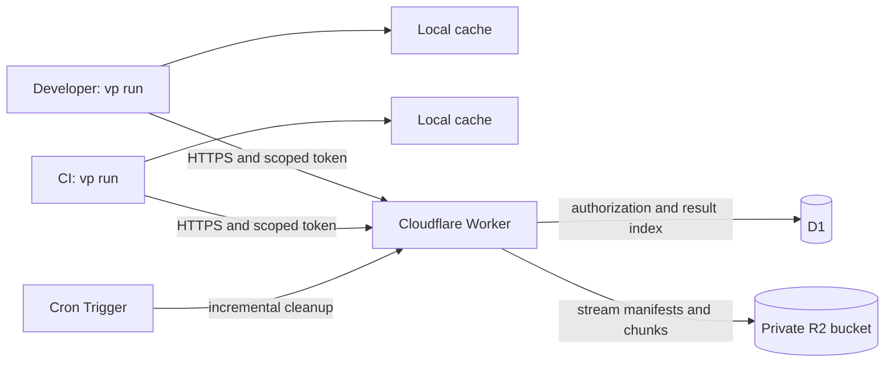

# RFC: Self-hosted remote cache for `vp run`

Status: Proposed. This document specifies the first version; the APIs and configuration below do not exist yet.

Date: 2026-09-07. Repository baseline: `9a1d32cf`.

## 1. Motivation

Developers and CI should reuse successful task results without copying a whole local cache directory between machines. Users must be able to deploy the service into their own Cloudflare account, retain control of its data and credentials, and operate it without a Vite+ hosted account or license service.

The current [docs deployment action](https://github.com/voidzero-dev/vite-plus/blob/ed1710f7aff8941436907a4d755d6b38c798ed41/.github/actions/deploy-docs/action.yml) restores and saves `docs/node_modules/.vite/task-cache` through GitHub Actions Cache. Its keys include OS, architecture, ref, and commit. Restore prefixes select the latest cache for the ref, then fall back to `main`; task fingerprints determine whether its contents can actually be reused. This is a useful CI bootstrap, but developers cannot use it as a native shared task cache, and each save transfers a directory snapshot.

This RFC proposes an optional second cache tier: check local results, check remote results, then execute. A successful execution remains available locally even if the remote service fails. Remote storage holds individual execution results, including their observed inputs, output files, and terminal output.

## 2. Decisions and scope

| Area        | Version 1 decision                                                                                       |
| ----------- | -------------------------------------------------------------------------------------------------------- |
| Hosting     | Open-source TypeScript Worker, private R2 Standard bucket, D1 database, and a Cron Trigger               |
| Ownership   | One deployment per organization or team; explicit project and trust namespaces within it                 |
| Client      | Native Rust integration in the execution engine; provider-independent versioned HTTPS protocol           |
| Discovery   | Bounded candidate lookup followed by local validation of explicit and inferred inputs                    |
| Identity    | SHA-256, canonical portable metadata, and an explicit platform/toolchain compatibility identity          |
| Publication | Immutable results; upload all bytes before an atomic D1 transition makes a result visible                |
| Trust       | Scoped bearer tokens and mandatory publisher signatures; CI and developer write permissions are separate |
| Transfer    | Streaming, retryable chunks of at most 64 MiB; at most 1 GiB compressed per result                       |
| Retention   | Seven-day retention by default; optional 30-day history, storage budgets, and incremental cleanup        |
| Failure     | Remote failures become misses or skipped uploads, with bounded waits and diagnostics                     |

Version 1 includes local-to-CI, CI-to-local, and CI-to-CI reuse on compatible machines, on macOS, Linux, and Windows. A fresh checkout with an empty local cache must be able to hit an automatically inferred remote result. No Git commit, branch, absolute checkout root, or local database identity is required for a hit.

Cross-OS and cross-architecture reuse are outside version 1. For example, a macOS developer can share with macOS CI, or use a Linux development container to share with matching Linux CI. A later portable-task mode needs a separate correctness contract. Also excluded are remote execution, a hosted SaaS, anonymous/public caches, OIDC federation, a web dashboard, cross-project content deduplication, and direct compatibility with Nx or Turborepo clients.

## 3. Current implementation and implications

The following are source identifiers, not proposed public API names:

| Evidence at the baseline                                                                                                                                                                                                  | Consequence for this design                                                                                                                                      |
| ------------------------------------------------------------------------------------------------------------------------------------------------------------------------------------------------------------------------- | ---------------------------------------------------------------------------------------------------------------------------------------------------------------- |
| [`ExecutionCache` and `CacheEntryKey`](../../crates/vt/src/session/cache/mod.rs) store SQLite rows keyed by spawn fingerprint and resolved input/output configuration. Input contents are in the value.                   | The existing key is a discovery key, not a complete immutable result key. Simply exposing `GET`/`PUT` for that key would overwrite results from other revisions. |
| [`ExecutionCache::try_hit`](../../crates/vt/src/session/cache/mod.rs) compares explicit glob inputs and then validates the post-run fingerprint.                                                                          | A remote hit must do both checks on the receiving machine. A server lookup alone cannot establish a hit.                                                         |
| [`PostRunFingerprint`](../../crates/vt/src/session/execute/fingerprint.rs) records file contents, missing paths, directories and their optional entry lists, tracked environment variables, and bulk environment queries. | A remote manifest must preserve these observations, including negative dependencies and environment match sets. A plain output archive is insufficient.          |
| [`ExecutionCacheKey` and `SpawnFingerprint`](../../crates/vt_plan/src/cache_metadata.rs) distinguish task identity from execution configuration. Outside-workspace programs are identified by name.                       | Keep execution-based sharing between equivalent tasks, but add toolchain identity before sharing between machines.                                               |
| [`TrackedPathAccesses::from_raw`](../../crates/vt/src/session/execute/tracked_accesses.rs) drops outside-workspace and `.git` accesses.                                                                                   | Existing inference is not a hermetic build guarantee. External dependencies need a declared environment contract.                                                |
| [`update_cache`](../../crates/vt/src/session/execute/cache_update.rs) rejects failures, cancellation, incomplete tracking, inferred read/write overlap, and tool-requested cache disabling.                               | Remote publication must inherit every eligibility check. It must not export arbitrary successful process output.                                                 |
| [`archive`](../../crates/vt/src/session/cache/archive.rs) writes regular files as `tar.zst`; [`replay_cache_hit`](../../crates/vt/src/session/execute/mod.rs) replays terminal output before extraction.                  | Remote import needs a bounded, validated staging path and must complete restoration before reporting a hit or replaying output.                                  |
| [`cache_schema_dir_name`](../../crates/vt/src/session/cache/mod.rs) selects local schema `v18`; file hashes use `xxHash3_64`, while [`EnvValueHash`](../../crates/vt_plan/src/envs.rs) uses SHA-256.                      | Do not publish SQLite files, Rust memory layouts, `wincode` values, or existing non-cryptographic input hashes as the wire format.                               |

The first implementation must extract a common validation layer with a versioned digest representation. Preserve local mismatch explanations and existing task scheduling. The additional SHA-256 work is required for remote-capable executions; local-only execution can retain its fast hash path.

## 4. Lessons from Nx and Turborepo

Nx's [cache client](https://github.com/nrwl/nx/blob/fc41a1b479677fdb4a5166c85053c152ea3abb6a/packages/nx/src/tasks-runner/cache.ts) checks local storage, retrieves a remote result on a miss, and imports that result into the local cache. Its [self-hosted protocol](https://nx.dev/docs/kb/self-hosted-caching) defines authenticated archive upload/download at `/v1/cache/{hash}`, including `403` for forbidden access and `409` for attempted overwrite. Adopt local promotion and immutable publication. Nx's [deprecation guidance](https://nx.dev/docs/reference/deprecated/self-hosted-cache-packages) also identifies poisoning risks in shared bucket caches. Immutability prevents replacement, but cannot prevent an untrusted writer from publishing a bad result first.

Turborepo publishes an [HTTP API specification](https://github.com/vercel/turborepo/blob/f6d5f18dfdcea4070ae8dc07300e5a735d529eb7/apps/docs/lib/remote-cache-openapi.json) with artifact existence, download, upload, query, and event operations. Its [HTTP cache implementation](https://github.com/vercel/turborepo/blob/f6d5f18dfdcea4070ae8dc07300e5a735d529eb7/crates/turborepo-cache/src/http.rs) integrates archive transfer and signature verification. Its [remote caching guide](https://turborepo.dev/docs/core-concepts/remote-caching) describes optional HMAC-SHA256 artifact signatures and treating invalid signatures as misses. Adopt an open protocol and verification before use. Use asymmetric publisher signatures here so readers need no signing secret.

Neither protocol directly solves this engine's post-execution dependency discovery. Our separate candidate index is intentional. An adapter for another client would need its own namespace and artifact semantics; sharing a hash spelling does not make results interchangeable.

## 5. User configuration and trust setup

Add a workspace-root `run.remoteCache` setting in `vite.config.*`. Package configurations cannot replace the endpoint or credential source. Proposed configuration:

```ts
export default {
  run: {
    remoteCache: {
      url: 'https://cache.example.com',
      project: 'docs',
      namespace: 'trusted',
      epoch: '1',
      mode: 'read',
      environment: 'node-toolchain-2026-09',
      trustedKeys: {
        'ci-2026-09': '<base64-encoded Ed25519 public key>',
      },
    },
    tasks: {
      'build:site': {
        command: 'vitepress build',
        env: ['DOCS_SITE_ORIGIN'],
        output: ['.vitepress/dist/**'],
      },
      'private-report': {
        command: 'node private-report.mjs',
        remoteCache: false,
      },
    },
  },
};
```

`remoteCache` is absent by default. A configured service defaults to `read`. Modes are `off`, `read`, `write`, and `read-write`; they control only the remote tier. A task-level `remoteCache: false` disables both remote directions for that task but permits local caching. Existing task `cache: false`, `--no-cache`, and tool-requested cache disabling take precedence over all remote settings.

Credentials come only from the host environment or a user-owned credential file outside the checkout. `VP_REMOTE_CACHE_TOKEN` supplies the scoped bearer token. Writers additionally provide `VP_REMOTE_CACHE_SIGNING_KEY` and `VP_REMOTE_CACHE_SIGNING_KEY_ID`. The private key is base64-encoded PKCS#8 Ed25519; trusted public keys are base64-encoded raw 32-byte keys. No token or private key is accepted in checked-in configuration or a command-line flag. Tokens contain a public lookup ID and a cryptographically random 256-bit secret; store only the secret's SHA-256 digest and compare it in constant time. Give tokens explicit expiry dates and support overlapping old/new credentials during rotation.

Support `VP_REMOTE_CACHE_URL`, `VP_REMOTE_CACHE_PROJECT`, `VP_REMOTE_CACHE_NAMESPACE`, `VP_REMOTE_CACHE_EPOCH`, `VP_REMOTE_CACHE_MODE`, `VP_REMOTE_CACHE_ENVIRONMENT`, and `VP_REMOTE_CACHE_TRUSTED_KEYS` as explicit host overrides. `TRUSTED_KEYS` is a JSON key-ID-to-public-key map that replaces the configured map. Host values override workspace values. `--no-remote-cache` overrides both and leaves local caching enabled. Missing credentials or required trust settings disable the remote tier with one diagnostic. Invalid configuration is reported before task execution. No automatic fallback to another service or namespace is allowed.

Remove all `VP_REMOTE_CACHE_*` variables from child environments, environment fingerprints, runner-aware environment APIs, serialized plans, and debug output, even when a task requests `env: ["*"]`. The client must not expose these control credentials to tools through normal environment propagation. This does not isolate credentials from malicious code running under the same OS account; CI secret placement must respect the job's trust boundary.

`environment` is an operator-maintained identifier for external build dependencies, such as an image digest or a pinned development-toolchain revision. It is required in version 1. Matching labels assert equivalent external dependencies; they do not measure them. Documentation must explain when to change this value and when to disable remote caching.

### Recommended permissions

| Principal                                           | Namespace       | Permission and signing keys                                      |
| --------------------------------------------------- | --------------- | ---------------------------------------------------------------- |
| Protected CI jobs                                   | `trusted`       | Read/write token and a CI publisher private key                  |
| Developer reading CI results                        | `trusted`       | Read-only token and trusted public keys                          |
| Developer publishing shared local results           | `team`          | Individual read/write token and individual publisher private key |
| CI job that intentionally accepts developer results | `team`          | Read-only token and an explicit approved publisher key set       |
| Untrusted fork pull request                         | None by default | No tokens or signing keys                                        |

This supports both directions of reuse without silently making release builds trust every laptop. Each invocation selects one namespace. Automatic fallback from `trusted` to `team` is forbidden. A team that wants full bidirectional sharing can explicitly use `team` in both developer and CI environments.

For jobs that run code from a pull request, endpoint, namespace, epoch, mode, and trusted keys must come from protected workflow settings if credentials are supplied. Do not give shared write credentials to arbitrary PR code, including via `pull_request_target`. A read token also grants access to potentially private artifacts and logs. A cache signature proves publisher identity and byte integrity, not that the publisher ran trustworthy code.

## 6. Cache identity and discovery

### Canonical encoding

Define `vp-cache-v1` metadata independently of local storage. Use UTF-8 JSON with RFC 8785 JSON Canonicalization Scheme (JCS). Reject duplicate object keys, unsupported fields for the selected format, invalid UTF-8, and numbers outside the schema's safe integer range. Encode digests as lowercase hexadecimal, bytes as base64, and paths as workspace-relative strings with `/` separators. Normalize neither path case nor Unicode. Sort semantic sets before encoding; preserve command argument and terminal event order.

Use SHA-256 over file bytes and canonical observations. Hash each domain as the canonical array `[domain, value]` to avoid ambiguous concatenation. An empty value, an absent environment variable, and a missing file have different tagged encodings. Normative schemas and Rust/TypeScript golden vectors must ship before protocol implementation is considered complete. The [JCS specification](https://www.rfc-editor.org/rfc/rfc8785) defines the byte-level canonicalization.

### Two keys

```text
compatibility = {
  fingerprint_format, artifact_format, engine_cache_abi,
  os, arch, platform_abi, filesystem_semantics,
  runtime_identity, executable_identity, lockfile_digests, environment
}

lookup_key = SHA256(JCS(["vp-cache-lookup-v1", {
  compatibility, spawn_fingerprint, input_config, output_config
}]))

result_key = SHA256(JCS(["vp-cache-result-v1", {
  lookup_key, explicit_inputs, inferred_inputs,
  tracked_envs, tracked_env_queries
}]))
```

Every storage/API identity also includes `(project, namespace, epoch)`. These values are bound by the signature. Branch and commit may appear in optional diagnostics, but never determine a hit. `ExecutionCacheKey` remains a local diagnostic association; equivalent execution configurations can still share results.

`lookup_key` is available before a task runs. `result_key` identifies a particular observed input state. Output bytes, execution duration, and terminal output are excluded from `result_key`; two executions with the same inputs compete for one immutable result.

Compatibility includes the engine cache ABI, initially tied to the exact released engine version and build features. It also includes OS/architecture, Linux libc family and version where applicable, OS release, and filesystem case-sensitivity behavior. Managed Node.js uses its full version and module ABI. Hash the resolved executable's bytes; if it is a script or shim, include its interpreter identity. Include the workspace package-manager identity and lockfile paths/content digests. Resolve these values once per invocation where possible, and invalidate memoized file digests on change. Do not invoke arbitrary project commands merely to discover a version.

These conservative dimensions can cause misses between machines that would have produced identical output. That is preferable to reusing a native binary or tool result under an incompatible runtime. Unknown required compatibility information disables remote reuse for that execution. Child tools and external libraries that the engine cannot identify automatically are part of the declared `environment` contract.

Keep raw command arguments and tracked environment values semantically unchanged when hashing; hash environment values rather than serializing their plaintext. Do not replace arbitrary occurrences of an absolute path inside strings. Such values can cause a miss across checkout roots. Tools that embed absolute roots in output must be configured for relocatable output or excluded from remote caching. Logs can contain the original checkout path; do not rewrite them.

### Candidate lookup and validation

1. Validate a compatible local entry first. On a local hit, make no remote request and do not backfill old entries into remote storage.
2. Request candidates for `lookup_key`. D1 returns only committed, unexpired entries from active publishers in the authorized scope, newest first with `result_key` as a stable tie-breaker. Return eight references per page, with an opaque cursor bound to the scope, lookup key, and first-page publication watermark.
3. Verify the small signed descriptors returned with candidates, then fetch their manifests and verify the signed manifest digests. Require scope, formats, and lookup key to match locally computed values. Never let a manifest replace local command/configuration data.
4. Re-enumerate explicit globs using the current resolved configuration; compare the full path set and SHA-256 file digests. Validate every inferred observation: file content, absence, directory existence, and a sorted entry-name/type set when enumeration was observed. Validate input symlink chains as specified in section 7. Re-evaluate tracked environment queries against the same planning context used by runner-aware APIs. Compare missing values and complete query match sets.
5. Recompute `result_key` from the current observations. A candidate is eligible only if every observation matches and the result key matches. Then fetch and restore its artifact as described below.
6. Stop after 32 candidates, 16 MiB of manifest metadata, or the lookup deadline, whichever comes first. No valid candidate means execute locally. A bounded search may miss an older valid result; it cannot turn a mismatch into a hit.

The service keeps all unexpired results subject to project quotas; the 32-candidate limit bounds each lookup rather than overwriting older entries. The client can retain authenticated manifest metadata to avoid repeated downloads, but must revalidate inputs and current local trust policy before reuse. There is no local-history requirement for cold lookup.

For example, two branches run the same `build` command. Both have the same lookup key, but changed source bytes produce different result keys. Both results can coexist. A fresh checkout evaluates each candidate against its own source tree. Creating a previously missing import or adding a directory entry invalidates the corresponding candidate.

Input inference retains its existing limits: ignored inputs, untracked environment values, time, network responses, and unobserved external files can affect output. Remote caching does not make non-deterministic tasks safe. Preserve complete raw tracking long enough to flag outside-workspace writes and unsupported path representations; these make a result ineligible for remote publication. External reads need the documented environment contract. Compute explicit input SHA-256 values before execution, then create inferred observations after the existing tracking/overlap checks. Recheck observed inputs before publication and immediately before restoration; a detected change cancels reuse/publication. This detects ordinary concurrent edits, not arbitrary mutation-and-reversion races. Do not claim filesystem snapshot isolation.

## 7. Wire artifact and safe restoration

Each result consists of a small signed descriptor, a validation manifest, and one canonical `tar.zst` stream split into numbered transport chunks. The archive contains regular output files under `outputs/` and one `stdio.json` with ordered stdout/stderr byte events. No-output tasks still have a valid archive for terminal output. Duration is metadata; the only publishable exit status is success.

The descriptor is bounded to 8 KiB so server-side authentication and signature verification do not scale with the number of inferred inputs. It contains:

| Field group | Contents                                                                                        |
| ----------- | ----------------------------------------------------------------------------------------------- |
| Identity    | Protocol/format versions, scope, lookup key, result key, compatibility digest, publisher key ID |
| Manifest    | SHA-256 and byte size of the canonical validation manifest                                      |
| Artifact    | Compressed SHA-256 and size; ordered chunk sizes and SHA-256 digests; expanded size             |
| Bounds      | Output-file count and terminal-output byte count                                                |

The descriptor envelope contains `body` and a base64 Ed25519 `signature` over `JCS(["vp-cache-descriptor-v1", body])`. Its digest is SHA-256 of the canonical envelope. D1 stores this small envelope and returns it inline with candidate references, so discovery does not add a separate descriptor download. Public keys are pinned by the consumer's configuration, not accepted from a download. The Worker verifies that the publisher key is active and permitted for the token's scope; consumers verify independently. Cloudflare supports Ed25519 through its [Web Crypto API](https://developers.cloudflare.com/workers/runtime-apis/web-crypto/).

The validation manifest contains the matching identity, full explicit/inferred input observations, tracked environment hashes and queries, exact output-file inventory with SHA-256/size/executable bits, terminal-output digest, success status, and elapsed milliseconds. The client verifies its signed digest before parsing, then checks that all duplicated identity and bound fields match the descriptor. Changing any manifest byte invalidates the descriptor's signature binding. The full input and result-key checks remain on the consuming client.

The Worker treats the manifest as opaque bytes and uses R2's checksum verification on upload. It never parses or canonicalizes a multi-megabyte manifest or decompresses an artifact. This preserves the 4 MiB manifest limit for Free users while moving expensive validation to the clients, which already need to perform it. All hosting profiles use the same protocol and mandatory signatures; Free support does not reduce validation or task input coverage.

Archive creation sorts paths and removes host-specific owner/group names, timestamps, and unnecessary metadata. Preserve file bytes and the executable bit; never preserve ownership, ACLs, setuid/setgid bits, or arbitrary extended attributes. Version 1 rejects symlink/hardlink outputs, devices, FIFOs, sparse files, and other special entries for remote publication. Workspace input symlinks must resolve within the workspace, and the remote fingerprint includes every link in the resolution chain, its relative target, and the final resolved observation; loops or outside-workspace targets disable remote reuse. Validate ancestor links as well as the final path. This is stricter than the current local archive path.

Client and server enforce these protocol maxima; deployments may lower them and advertise effective limits:

| Limit                                      | Maximum                                        |
| ------------------------------------------ | ---------------------------------------------- |
| Signed descriptor                          | 8 KiB                                          |
| Canonical validation manifest              | 4 MiB                                          |
| Chunk                                      | 64 MiB; all but the final chunk have this size |
| Compressed archive                         | 1 GiB, at most 16 chunks                       |
| Expanded archive including terminal output | 8 GiB                                          |
| Output files                               | 100,000                                        |
| Terminal output bytes                      | 16 MiB                                         |
| Metadata nesting                           | 32 levels                                      |

An oversized result remains local and produces a remote-skip diagnostic. Do not silently truncate logs or omit output files to fit limits. Compress and hash to a temporary disk file, then stream its chunks with bounded memory. The Worker never decompresses an archive or buffers artifact chunks. Multiple chunk requests avoid the account-plan [request size limit of 100 MB on Free/Pro](https://developers.cloudflare.com/workers/platform/limits/) and the runtime's 128 MB per-isolate memory limit.

The receiving client must complete the following before a cache hit is observable:

1. Download into an invocation-owned staging directory, verify each chunk digest/size and the complete compressed digest, then decompress with explicit byte, file-count, path-length, nesting, and disk-space bounds. A manifest's stated expanded size is not a substitute for counting actual bytes.
2. Validate every archive entry against the signed output inventory. Reject duplicates, undeclared entries, missing entries, absolute paths, `..`, NUL, drive/UNC paths, Windows alternate data streams and reserved names, and case aliases on a case-insensitive destination. Reject `.git` and the runner's own cache/staging directories. Interpret `/` consistently on all platforms; never treat a backslash as a permitted escape route.
3. Require all output paths to satisfy the current explicit output rules or the signed auto-output inventory under the matching configuration. Verify each extracted file's digest and executable bit. Auto-output inventories are publisher-authorized filesystem writes, which is another reason writers must be trusted.
4. Restore regular files with workspace-root-anchored operations that reject symlink/reparse-point ancestors. Use temporary files on the destination filesystem and atomic replacement per file. Journal replacements and retain backups until the whole restore succeeds. If restore fails, roll back before running the task; if rollback cannot complete, fail with a local filesystem error. Never execute a task over a partly restored workspace and call that a remote miss.
5. Commit the local cache record and artifact reference, then replay terminal output and report a remote hit. Recover or clean incomplete restore journals before later invocations use affected paths. Concurrent invocations must coordinate overlapping restore paths; the existing scheduler still orders task dependencies.

This gives atomic publication of local cache metadata and recoverable multi-file restoration, not a filesystem-wide atomic transaction. No staging file is promoted to the workspace before all downloaded bytes and paths are verified. Existing files outside the output inventory are left in place, matching current restoration behavior; tasks that require deletion side effects are not eligible for remote caching in version 1.

## 8. Cloudflare service architecture



The Worker performs authentication, bounded descriptor-schema checks, publisher-signature validation, indexed lookup, upload coordination, and streaming. R2 holds artifact chunks and manifests through a binding. Disable public bucket access and do not expose S3 credentials, public object URLs, or presigned URLs to clients.

D1 holds compact metadata and signed descriptors; large manifests remain in R2. This avoids depending on D1's [2 MB row limit](https://developers.cloudflare.com/d1/platform/limits/). Use prepared statements, indexes, conditional writes, and transactional `batch()` calls. [D1 batches roll back if a statement fails](https://developers.cloudflare.com/d1/worker-api/d1-database/); a conditional update affecting zero rows is not an exception, so dependent changes must be guarded in SQL as well. Do not perform a read in JavaScript and assume a later write is still exclusive.

Keep authorization, reservation, commit, and deletion on the D1 primary. Version 1 also reads candidates from the primary, with read replication disabled. If replication is introduced later, [Sessions and bookmarks](https://developers.cloudflare.com/d1/best-practices/read-replication/) must preserve read-after-publish behavior, and replica lag must not delay credential revocation.

### Logical data model

| Table               | Key data and indexes                                                                                                                                                                                        |
| ------------------- | ----------------------------------------------------------------------------------------------------------------------------------------------------------------------------------------------------------- |
| `deployment_budget` | Singleton byte/entry limits and charged totals shared by every namespace and epoch                                                                                                                          |
| `namespaces`        | `(project, namespace, epoch)`; active flag, retention, byte/entry quotas, charged bytes/entries                                                                                                             |
| `tokens`            | Public token ID, SHA-256 of a random secret, principal ID, allowed scope/modes, expiry, revocation; lookup by token ID                                                                                      |
| `publisher_keys`    | Scope, key ID, Ed25519 public key, allowed principal IDs, active flag                                                                                                                                       |
| `entries`           | Unique `(scope, lookup_key, result_key)`; upload ID/generation, owner principal, immutable signed descriptor and its digest, manifest receipt, total size, state, lease deadline, publish/expiry timestamps |
| `chunks`            | Unique `(upload_id, ordinal)`; expected size/digest and upload receipt                                                                                                                                      |

Add indexes on `(scope, lookup_key, state, published_at DESC, result_key)` and `(state, lease_deadline)` / `(state, expires_at)` for discovery and cleanup. A monotonically increasing publication sequence supplies the page watermark. Never store source file contents or plaintext tracked environment values in D1. Use an unpredictable upload ID; R2 keys are server-derived:

```text
v1/<project>/<namespace>/<epoch>/<upload-id>/manifest.json
v1/<project>/<namespace>/<epoch>/<upload-id>/chunks/0000
```

No cross-entry or cross-project blob sharing occurs in version 1. Deleting one generation cannot break another result, and no reference-counted garbage collector is needed.

R2 provides [strong consistency for writes and deletes](https://developers.cloudflare.com/r2/reference/consistency/). Its [Worker API](https://developers.cloudflare.com/r2/api/workers/workers-api-reference/) supports conditional writes and a supplied SHA-256 checksum. Use create-only object writes and checksum verification for manifests/chunks. A successful D1 commit is the visibility boundary across the two stores; there is no distributed D1/R2 transaction.

## 9. HTTP protocol and publication state machine

All cache endpoints start with `/v1/projects/{project}/namespaces/{namespace}/epochs/{epoch}` (abbreviated `S` below). Project, namespace, epoch, and publisher key IDs match `[a-z0-9][a-z0-9_-]{0,63}`; keys are 64 lowercase hex characters. Upload IDs are server-generated random 128-bit values encoded as 32 lowercase hex characters. Reject non-canonical or multiply encoded path segments. Authorize the complete scope before looking up entries or accessing R2. A token never gains permissions from caller-supplied project or namespace headers. Read-only principals can use discovery/download endpoints; write-only principals can use capabilities and their own upload lifecycle, without general artifact access.

All responses use `Cache-Control: private, no-store`. Require verified HTTPS in production, with no redirects. Local development permits HTTP only on explicit loopback URLs. The server returns paths relative to its own origin; the client rejects arbitrary artifact URLs. Do not forward credentials across hosts or disable certificate validation. No CORS access is enabled by default.

| Request                                                    | Behavior                                                                                                                                                         |
| ---------------------------------------------------------- | ---------------------------------------------------------------------------------------------------------------------------------------------------------------- |
| `GET /healthz`                                             | Public liveness only; no configuration or dependency details                                                                                                     |
| `GET S/capabilities`                                       | Authenticated formats, effective size limits, and retention                                                                                                      |
| `GET S/lookups/{lookup_key}?cursor=...`                    | `200` with candidate references, signed descriptors, result keys, and next cursor; an empty list is a miss                                                       |
| `GET S/results/{lookup_key}/{result_key}/manifest`         | `200` streamed validation manifest for a ready result; otherwise `404`                                                                                           |
| `GET S/results/{lookup_key}/{result_key}/chunks/{ordinal}` | Stream one immutable chunk of a ready result; otherwise `404`                                                                                                    |
| `POST S/uploads`                                           | Body is the canonical signed descriptor, with `Idempotency-Key`; reserve the result and quota; `201` with upload ID, deadline, and relative manifest/chunk paths |
| `PUT S/uploads/{upload_id}/manifest`                       | Require `Content-Length`; stream and verify the reserved manifest digest/size; `204` on success or an identical retry                                            |
| `PUT S/uploads/{upload_id}/chunks/{ordinal}`               | Require `Content-Length`; verify expected digest and length while writing the stream; `204` on verified success or an identical retry                            |
| `POST S/uploads/{upload_id}/commit`                        | Confirm all bytes and permissions, then publish; `201` for the winning commit, `200` for its identical retry                                                     |
| `DELETE S/uploads/{upload_id}`                             | Owner can abandon a pending upload; idempotent `204`; cannot delete a published result                                                                           |

Each chunk response includes `Content-Length` and its SHA-256 in `VP-Cache-SHA256`. The signed descriptor and its manifest digest remain the client's authority for integrity; an R2 ETag is not a content checksum contract. JSON errors have `{ "code": "...", "requestId": "..." }`, without arbitrary reflected request text. `401` means missing/expired/revoked credentials; `403` means insufficient scope or publisher permission. `400` covers malformed data, `413` size limits, `422` checksum/signature/schema failure, `429` quota/rate limits, and `503` transient storage failure. `409` distinguishes `already_exists`, `upload_in_progress`, `descriptor_conflict`, and `lease_expired`.

### Publication

```text
absent -> uploading -> ready -> deleting -> absent
                \------------> deleting -> absent
```

1. Authenticate and validate the small signed descriptor, scope, digest syntax, and size/chunk bounds. The service treats lookup and result keys as opaque; it cannot validate the publisher's actual command or source tree. In one D1 transaction, reserve the full manifest-plus-archive byte count and entry slot, insert an `uploading` row, and create its expected chunk rows. Quota checks and counter updates must be enforced in the same transaction, using SQL constraints/triggers or guarded statements. Return no usable upload location until reservation succeeds.
2. Upload the canonical validation manifest and chunks under the reserved upload ID. Each PUT must match its reserved size/digest and owner, and the upload must still be active. Stream directly to an R2 create-only write with the expected SHA-256. After success, conditionally record its receipt in D1. A lost response or failed receipt write is recovered by checking the existing object's checksum and size on retry; never overwrite different bytes.
3. At commit, verify the manifest receipt and all expected chunk receipts against R2 HEAD checks for size/checksum. Do not read and parse the manifest. Bound concurrent HEAD calls and keep the entire request within the Free profile's query/subrequest budget. In a single D1 transaction, require the token, publisher key, and namespace to still be active, compare the upload ID/state/deadline, and transition to `ready`, setting publication sequence/time and `expires_at`. Authorization predicates must be part of the guarded transition, so concurrent revocation cannot be bypassed by an earlier JavaScript check. Return success only after that transaction commits. Retention starts at publication; there is no background publication through `waitUntil()`.
4. Readers select only `ready` entries and check expiry/authorization again for manifest and chunk reads. If an object is missing despite a ready row, treat it as a miss, record an integrity error, and schedule that entry for cleanup. Do not replay logs or partial files.

Idempotency keys are random 128-bit values, bound to principal, scope, and descriptor digest for the upload lifetime. Persist this binding in `entries` with a unique `(principal, scope, idempotency_key)` constraint. Repeating the same reservation returns its upload ID, manifest receipt status, and missing chunks; interrupted manifest uploads resume through the idempotent manifest PUT. Reusing the key with different bytes returns `409`. Another writer for an `uploading` result receives `409 upload_in_progress` and need not wait. After an abandoned generation is reclaimed, a new reservation always gets a new upload ID.

A published result cannot be replaced. A new reservation for it receives `409 already_exists` with the winning descriptor digest. The client treats this as upload deduplication, not a failed task. Compare output-file inventory/content digests if both manifests are available: different output files under the same result key produce a nondeterminism diagnostic. Duration or log timing differences alone are not proof of incorrect output. An identical commit retry is successful only for the original upload ID.

An upload lease lasts 15 minutes and is not extended in version 1. Server-side body transfer deadlines are two minutes per chunk. On a late write after lease loss, reject the receipt and remove that generation's object where possible; it can never become visible. Cleanup may safely retry removal because upload IDs are never reused.

## 10. Failure handling and local integration

Remote lookup begins only after task dependencies finish and the existing local lookup misses. Avoid network I/O while holding a SQLite lock or an output-restoration lock. Configure the session once and share an HTTP connection pool, per-invocation manifest/digest memoization, and a bounded transfer scheduler across tasks.

Default budgets are 2 seconds to connect, 5 seconds for discovery including manifest validation, 2 minutes per artifact request, and 5 minutes for a complete artifact transfer. The receiving client rechecks inputs after download before restoration. Permit at most four transfers and two local compression/decompression jobs per invocation. End-to-end deadlines include queueing and retries. Use at most two jittered retries for connection failures, `408`, `429`, and `5xx`, respecting `Retry-After` within the deadline. Do not retry invalid credentials or invalid artifacts. After three transport/service failures, stop new remote work for the invocation; a new invocation can try again.

| Condition                                                          | Client behavior                                                                                                                                      |
| ------------------------------------------------------------------ | ---------------------------------------------------------------------------------------------------------------------------------------------------- |
| Missing result, no matching candidate, or bounded search exhausted | Execute normally                                                                                                                                     |
| Timeout, unavailable service, or exhausted quota                   | Execute locally or keep the local result; summarize once                                                                                             |
| `401` / `403`                                                      | Disable the affected remote direction for this invocation and report setup information without secrets                                               |
| Invalid signature, digest, manifest, or archive                    | Discard and quarantine the entry ID for the invocation; report rejected remote data; execute only if the workspace is untouched or fully rolled back |
| Failed/cancelled/non-cacheable task                                | Never upload                                                                                                                                         |
| Upload conflict                                                    | Keep local result; use the immutable-winner rules above                                                                                              |
| Local extraction, disk, or rollback failure                        | Surface a local error when safe execution cannot continue                                                                                            |
| Unsupported protocol/format                                        | Disable remote use and state the compatibility reason; local execution continues                                                                     |

After an eligible execution, save the local result first and enqueue its immutable export with owned file handles or a pinned spool copy. Do not let a subsequent local cache update delete an archive that is still being uploaded. Drain uploads before normal process exit, for at most 30 seconds after the last task finishes; then cancel remaining uploads and report skipped publication. Cancellation aborts remote work promptly. The task's success never depends on an upload finishing.

The new local schema must distinguish locally executed results from remote imports and persist compatibility, strong input digests, signed descriptor and manifest, artifact digest, and source scope. When remote mode is enabled, local hits must match the current compatibility and consumer trust policy. Remote imports must still have an accepted publisher key and epoch; changing either invalidates those imports. Locally executed records belong to the current user's local trust boundary and are never automatically signed and republished on a hit.

Legacy entries do not contain the required strong fingerprints or provenance. Do not derive a new remote result by rehashing the current tree beside an old archive. Keep local-only behavior available; the first remote-enabled run of such a task must execute again to create a verified export. Bump the local schema when implementing this, independently of the remote wire version.

Extend cache events with `local_hit`, `remote_hit`, `remote_miss`, `remote_rejected`, and `remote_upload_skipped`, preserving existing miss explanations. Report aggregate transferred bytes and remote wait time, plus individual reasons in debug output. `vp cache clean` continues to affect only local storage. A future explicit admin operation may purge a remote namespace; a normal client token cannot do so.

## 11. Retention, quotas, and operations

Each namespace has an operator-defined storage-byte quota, entry quota, request-rate limit, and maximum active uploads per principal. Add a deployment-wide byte/entry budget so separate projects and epochs cannot each consume the entire free allowance. Reservations must satisfy both budgets atomically. Pending and ready entries both consume reserved bytes. All upload/retry paths enforce the same limits. Use primary-backed counters for exact reservations; an edge-local rate limiter can be an additional load-shedding measure, not a global quota guarantee. Request and CPU charges can still occur for rejected traffic, so these are storage/admission controls, not a hard Cloudflare bill cap.

Results expire seven days after publication in the default `free` hosting profile. Operators can select 30-day history or another explicit retention in an explicit custom hosting profile; retention is an operational choice, not a protocol or billing-plan difference. A custom profile can still use Workers Free. Reads and duplicate uploads do not extend the lifetime. Expired rows stop being discoverable immediately. A Cron Trigger runs every five minutes and persists a cursor. Each Free invocation processes at most 16 entries in one bounded batch; Paid can process 256. Group known object keys into bounded R2 delete calls instead of listing the bucket or looping until empty:

1. Atomically claim expired ready entries or abandoned uploads as `deleting`. No commit can win after this transition.
2. Delete only the claimed upload generation's manifest/chunks. Allow a five-minute grace after an upload lease expires to cover in-flight requests, then repeat cleanup of deleting generations. Treat missing objects as successful deletion.
3. Remove chunk rows and release quota only after cleanup succeeds. Retain a short-lived tombstone for late writes and retry cleanup when a receipt arrives for an abandoned upload. A failed delete keeps the row and quota charged until retried.

Configure an R2 lifecycle backstop longer than the maximum published retention plus upload lifetime and grace: nine days from object creation for seven-day retention, or 32 days for 30-day retention. Use separate prefixes or the longest applicable lifetime if policies share a bucket. Do not refresh object ages by overwriting them. [R2 lifecycle deletion is asynchronous](https://developers.cloudflare.com/r2/buckets/object-lifecycles/), so D1 expiry governs visibility. The backstop removes objects left by crashes, lost metadata, or exceptionally late writes. If retention changes, the deployment tooling must update and validate this relationship. Lifecycle alone must not delete still-live artifacts.

Log request ID, principal ID, operation, status, bytes, duration, and error class. Do not log bearer tokens, private keys, raw request bodies, environment names/values, archive contents, or full source paths by default. Track hit/miss/rejection rates, candidate count, transferred bytes, upload conflicts, active reservations, D1 latency/errors, R2 errors, and cleanup backlog. Alerts should cover sustained authorization failures, signature rejection, storage thresholds, and cleanup lag. Worker Logs and Cloudflare's D1/R2 metrics are sufficient initially; product telemetry must not require a central collection service. Sample successful request logs at 1% by default and bound error logging; no paid analytics or Logpush service is required. Read hits must not write last-access timestamps, token-usage rows, or analytics rows to D1. Exact byte/entry accounting happens at reservation and deletion; approximate edge rate limits and provider usage metrics cover request traffic without a database write on every read.

Artifacts and logs may contain source maps, generated source, secrets printed by tasks, and private filenames. They are private project data. Hashing environment values is not encryption and can expose low-entropy values to guessing. Operators choose who can read data and where Cloudflare stores it; signing does not hide it. The public documentation must include task exclusions and credential rotation procedures.

Token revocation takes effect on the next API request through primary D1 authorization, including chunk requests and commits. Key revocation blocks new publication and server reads from that publisher. For a compromised publisher, rotate the epoch and distribute updated client trust settings, then clean local imports. Server-side revocation cannot erase already downloaded bytes or revoke an offline client's local trust configuration.

Cache artifacts need no backup for correctness; losing them causes recomputation. Back up operator policy separately, and document D1 migration/restore procedures. After a partial D1/R2 restore, reconcile references or start a fresh epoch; do not assume D1 recovery also restores deleted R2 bytes. Upgrade schemas additively before upgrading the Worker, retain previous protocol support during rollout, and roll back Worker code only while the database remains compatible.

## 12. Self-deployment and GitHub Actions migration

Deliver a `packages/remote-cache` template in this repository, with TypeScript sources, pinned dependencies, a lockfile, `wrangler.jsonc`, D1 migrations, OpenAPI/JSON schemas, and an operator guide. The deployment must require only the user's Cloudflare account and local Node.js tooling. No external SaaS is part of the request path.

The template's setup flow must:

1. Create a private R2 Standard bucket and D1 database, then bind them as `ARTIFACTS` and `INDEX`. Give each environment separate resources.
2. Apply D1 migrations, install the lifecycle backstop and Cron Trigger, and configure retention/quotas. Pin a tested Worker compatibility date and enforce streaming/CPU bounds.
3. Bootstrap project/namespace/epoch, token hashes, and publisher public keys through an operator-only CLI using Cloudflare credentials. Generate individual random tokens and signing keys locally; never send publisher private keys to the Worker. No public administration endpoint is required.
4. Deploy to `workers.dev` or an optional custom domain with HTTPS, keep R2 public access disabled, and verify that unauthenticated reads/writes fail.
5. Print non-secret client configuration and a credential-storage guide. Run a small write/read/revoke/delete smoke test with temporary scoped credentials and isolated test data.

Publish exact tested commands with the implementation. The setup tooling should be idempotent, name every resource it creates, and support upgrades plus explicit teardown. Removing the Worker alone must not be described as removing stored data or ending storage charges. Include a local Miniflare workflow and a Cloudflare deployment smoke test; local emulation alone does not prove production consistency or limits.

Workers Free is the default production target for individuals and small teams. Setup selects the `free` hosting profile: seven-day retention, an 8 GB deployment-wide R2 byte budget including pending/deleting objects, and a 20,000-entry budget. Warn at 400 MB of actual D1 storage and at 80% of daily/monthly operation allowances. The `paid` profile changes operational budgets only after the operator selects them; subscribing to Workers Paid does not silently raise storage limits or retention. Section 13 quantifies when staying free is practical and when an upgrade helps. Real Free-plan CPU, cleanup, and usage measurements are a release gate, rather than a reason to require Paid in advance.

For the docs action, keep dependency installation and package-manager caching. Add remote credentials only to the `vp run build` step. A protected CI step would supply these proposed values:

```yaml
- run: vp run build
  working-directory: docs
  env:
    DOCS_SITE_ORIGIN: ${{ inputs.site-origin }}
    VP_REMOTE_CACHE_URL: ${{ vars.VP_REMOTE_CACHE_URL }}
    VP_REMOTE_CACHE_PROJECT: docs
    VP_REMOTE_CACHE_NAMESPACE: trusted
    VP_REMOTE_CACHE_EPOCH: '1'
    VP_REMOTE_CACHE_MODE: read-write
    VP_REMOTE_CACHE_ENVIRONMENT: ${{ vars.VP_REMOTE_CACHE_ENVIRONMENT }}
    VP_REMOTE_CACHE_TRUSTED_KEYS: ${{ vars.VP_REMOTE_CACHE_TRUSTED_KEYS }}
    VP_REMOTE_CACHE_TOKEN: ${{ secrets.VP_REMOTE_CACHE_CI_TOKEN }}
    VP_REMOTE_CACHE_SIGNING_KEY_ID: ci-2026-09
    VP_REMOTE_CACHE_SIGNING_KEY: ${{ secrets.VP_REMOTE_CACHE_CI_SIGNING_KEY }}
```

This excerpt belongs only in a job authorized to receive the writer credentials. Other jobs use a separate read-only setup or no remote credentials. The existing [docs task configuration](https://github.com/voidzero-dev/vite-plus/blob/ed1710f7aff8941436907a4d755d6b38c798ed41/docs/vite.config.ts) fingerprints `DOCS_SITE_ORIGIN`; preserve this distinction so production and preview outputs cannot be confused.

During a canary, the existing task-directory restore/save can remain, but it must stay within the same CI trust boundary and cannot be treated as signed provenance. Once remote-enabled clients and a fresh-run population are verified, remove the task-cache key computation and task-directory restore/save steps. Keep the dependency cache managed by `setup-vp`. To roll back, set remote mode to `off`; builds continue with local caching and can retain/reintroduce the old task-directory optimization.

## 13. Free and Paid capacity comparison

The default should stay within free allowances for representative individual and small-team workloads. This section separates provider limits from workload estimates. All prices are USD before tax, checked on 2026-09-07; all allowances assume no other applications consume them. Use a 30-day month and decimal MB/GB for the estimates. Team size alone is not a capacity measure: unique result size, publication frequency, remote hit rate, and retention matter more.

### Provider allowances and limits

A Free website/account plan, Workers Free/Paid, and R2 usage billing are separate choices. This service needs no Pro/Business website plan and can use `workers.dev`. [R2 must be enabled as a subscription](https://developers.cloudflare.com/r2/get-started/), even when usage is covered by its free allowance. R2 overages can produce charges while Workers remains Free; upgrading Workers does not increase the R2 free allowance. The setup guide must explain this distinction using Cloudflare's [billing model](https://developers.cloudflare.com/billing/understand/how-billing-works/).

| Workers resource                               | Free                          | Paid Standard                                                                                                   |
| ---------------------------------------------- | ----------------------------- | --------------------------------------------------------------------------------------------------------------- |
| Subscription                                   | $0                            | $5/month minimum                                                                                                |
| Dynamic requests                               | 100,000/day; daily hard limit | 10 million/month included; then $0.30/million; no equivalent daily quota                                        |
| HTTP CPU                                       | 10 ms per invocation          | 30 million CPU ms/month included; then $0.02/million CPU ms; 30 s per-invocation default, configurable to 5 min |
| Cron CPU at this design's five-minute interval | 10 ms per invocation          | 30 s per invocation                                                                                             |
| Memory                                         | 128 MB per isolate            | 128 MB per isolate                                                                                              |

Sources: [Workers pricing](https://developers.cloudflare.com/workers/platform/pricing/) and [runtime limits](https://developers.cloudflare.com/workers/platform/limits/). Network/storage wait time does not consume Worker CPU. A monthly average below 3 million requests does not prove Free eligibility: one busy day can exceed the daily limit. The 10 ms CPU limit applies to each request and each Cron invocation, not an average across them.

| D1 resource                   | Free                                  | Paid Standard                                              |
| ----------------------------- | ------------------------------------- | ---------------------------------------------------------- |
| Rows read                     | 5 million/day                         | 25 billion/month included; then $0.001/million             |
| Rows written                  | 100,000/day                           | 50 million/month included; then $1/million                 |
| Stored data                   | 5 GB/account; **500 MB per database** | 5 GB included; then $0.75/GB-month; **10 GB per database** |
| Queries per Worker invocation | 50                                    | 1,000                                                      |

Sources: [D1 pricing](https://developers.cloudflare.com/d1/platform/pricing/) and [D1 limits](https://developers.cloudflare.com/d1/platform/limits/). Count index maintenance and eventual deletion as writes, not just inserted result rows. Free daily exhaustion prevents further database work until reset; it does not automatically convert the service to Paid. Multiple deployments in one account share the daily allowance.

| R2 Standard resource                   | Included with either Workers plan | Beyond the included allowance |
| -------------------------------------- | --------------------------------- | ----------------------------- |
| Storage                                | 10 GB-month/month                 | $0.015/GB-month               |
| Class A operations, including PUT/LIST | 1 million/month                   | $4.50/million                 |
| Class B operations, including GET/HEAD | 10 million/month                  | $0.36/million                 |
| Internet egress; object DELETE         | No charge                         | No charge                     |

Source: [R2 pricing](https://developers.cloudflare.com/r2/pricing/). Included usage is account-wide, not per bucket. R2 storage billing uses the monthly average of daily peak usage; include pending uploads, expired objects awaiting deletion, and abandoned objects. R2 rounds billable storage/operation units up, so a small operation overage can cost a whole additional million-operation unit. The reference service uses Standard storage; Infrequent Access does not have the same free tier.

### Model: translate task activity into billable work

Let `L` be daily remote lookups **after local misses**, `H` remote hits, `U` new successful publications, `M` average manifests downloaded per lookup, `C` chunks per artifact, `S` mean stored MB per newly published result, and `R` retention days. For `S`, count the compressed `tar.zst` bytes (outputs and terminal events) plus the validation manifest's bytes in R2. Account for the signed descriptor in D1. Local hits make no service request. Retried or conflicting publications still consume operations, even though they do not add retained results.

A publication takes one descriptor reservation, one manifest PUT, `C` chunk PUTs, and one commit. A hit takes discovery, its candidate manifest downloads, and `C` chunk GETs. Unmatched candidates also cause manifest reads. Use these planning equations:

```text
Worker invocations/day = ceil(1.10 * (L * (1 + M) + H * C + U * (C + 3))) + 300
R2 Class A/month       = ceil(30 * 1.10 * U * (C + 1))
R2 Class B/month       = ceil(30 * 1.10 * (M * L + C * H + (C + 1) * U))
Retained R2 GB         = U * S * R / 1000
```

The 10% reserve covers ordinary retries, capabilities, conflicts, and cleanup overhead; 300 extra daily invocations conservatively cover the 288 Cron runs plus routine management. Normal GC deletes known object keys without an R2 LIST per result. R2 HEAD checks at commit are included. Reserve more for outages, deep candidate searches, or many small invocations; these formulas are not an upper bound against arbitrary traffic.

D1 costs depend on the actual schema and query plans. Until the implementation is measured, budget **64 rows read per lookup plus 32 per publication**, and **40 rows written over the complete life of a one-chunk result**, including indexes, receipts, quota counters, publication, GC, and tombstones. Reserve another 10% plus 5,000 daily reads/1,000 daily writes for maintenance. These are engineering budgets, not Cloudflare per-request rates:

```text
D1 reads/day  = ceil(1.10 * (64 * L + 32 * U)) + 5000
D1 writes/day = ceil(1.10 * 40 * U) + 1000
D1 storage MB = retained_results * 4096 / 1000000   # provisional one-chunk mean
```

The 4 KiB metadata estimate includes an ordinary small descriptor and indexes; an 8 KiB maximum descriptor or a 16-chunk result costs more. Measure `rows_read`, `rows_written`, and actual database bytes, including migrations and cleanup, before claiming these budgets. Additional chunks add receipt/index work; the one-chunk D1 equation must not be applied unchanged to large artifacts.

### Result-size assumption and measurement

Use **5 MB for a small-output scenario**, not a measured average or artifact-size limit. Measurements of four established products' published Vite frontend outputs on 2026-09-07 give the following comparison. The [artifact study](remote-cache-size-study/README.md) includes pinned sources, exact byte counts, and a reproduction script.

| Product and sampled release     | Output files MB | `tar.zst` MB | `tar.zst` MB without source maps |
| ------------------------------- | --------------: | -----------: | -------------------------------: |
| Directus `@directus/app@17.1.1` |           20.81 |         6.97 |                             6.97 |
| Docmost `v0.95.0`               |           14.83 |         4.77 |                             4.77 |
| Hoppscotch `2026.8.0`           |          127.53 |        32.18 |                            12.18 |
| n8n `n8n-editor-ui@2.16.2`      |          162.76 |        34.71 |                            13.15 |

These measurements isolate frontend output files from official npm releases or Docker build COPY layers and recompress them with zstd level 3. They exclude backend code, dependencies, terminal events, and the proposed validation manifest. We did not rebuild the projects or measure their private cloud deployments. The map-free column is a sensitivity calculation; the cache must preserve source maps when the task requires them.

Three of these four releases exceed 5 MB after compression. Add **50 MB as a complete-result planning case for mature SaaS frontends**, with room above the sampled frontend archives, and 100 MB as a stress case. Neither value is a measured population average or a guaranteed upper bound. At 200 new results/day and seven-day retention, a 50 MB mean needs 70 GB, so the earlier 7 GB estimate applies only to the 5 MB scenario. The Free-capacity estimates remain conditional on workload and measured service CPU.

Measure one cached task execution at a time. A monorepo run can publish several task results. A GitHub Actions archive of the whole local cache can contain many tasks and historical versions, so its size cannot substitute for `S`. Tasks with only terminal output, library builds, and application or documentation builds need separate samples; file inventories and compressibility differ.

Before using these scenarios to support a claim about average users:

1. Sample small repositories and monorepos across normal developer and CI changes. Include the docs canary, builds with source maps and static assets, and tasks with no output files. Record task type, compatibility identity, and observation period.
2. Measure the proposed remote archive and manifest bytes for each new stored result. Existing local output archives provide preliminary output-size data; add the proposed terminal-event encoding and validation manifest before estimating remote storage. Count separate stored copies across namespaces or compatibility identities, while excluding read hits and retries that create no new copy.
3. Compute `S = total newly stored bytes / new stored results / 1,000,000`. Report the mean, median, p95, maximum, and sample counts by task type and repository. Weight the storage mean by new publications; an average of repository averages can hide frequently rebuilt large tasks.
4. Record daily new bytes and peak retained bytes over at least two retention windows. Include pending uploads and cleanup lag. Report the fraction of sampled deployments that fit the default budget and the sample's limits before extrapolating to most users.

The release-artifact sample supplies size evidence for four frontend builds. It does not measure publication rates, hit rates, or the mix of tasks across users. At 200 new results/day and seven-day retention, the 1, 5, 20, 50, and 100 MB sensitivity cases require 1.4, 7, 28, 70, and 140 GB respectively, before pending uploads and cleanup lag.

### Illustrative workloads

Assume 80% of remote lookups hit (`H = 0.8 * L`), every remaining lookup publishes one new result (`U = 0.2 * L`), one manifest is read per lookup even on misses (`M = 1`), and every artifact fits one chunk (`C = 1`). These are illustrative user profiles, not measured usage statistics. Averaging 5 ms Worker CPU per modeled invocation is a **Paid-cost assumption**; Free eligibility still requires every operation class to stay within its 10 ms limit.

| Workload                         | Remote lookups/day | New results/day | Mean result | Retention | Retained R2 | Worker invocations/day | D1 writes/day |
| -------------------------------- | -----------------: | --------------: | ----------: | --------: | ----------: | ---------------------: | ------------: |
| Individual                       |                100 |              20 |        1 MB |    7 days |     0.14 GB |                    696 |         1,880 |
| Small-team scenario              |                500 |             100 |        5 MB |    7 days |      3.5 GB |                  2,280 |         5,400 |
| Active small-team scenario       |              1,000 |             200 |        5 MB |    7 days |        7 GB |                  4,260 |         9,800 |
| Same active team, longer history |              1,000 |             200 |        5 MB |   30 days |       30 GB |                  4,260 |         9,800 |
| Same active team, larger outputs |              1,000 |             200 |       20 MB |    7 days |       28 GB |                  4,260 |         9,800 |
| Mature SaaS frontend scenario    |              1,000 |             200 |       50 MB |    7 days |       70 GB |                  4,260 |         9,800 |
| Growing team                     |             20,000 |           4,000 |        5 MB |    7 days |      140 GB |                 79,500 |       177,000 |
| High volume                      |            100,000 |          20,000 |        5 MB |    7 days |      700 GB |                396,300 |       881,000 |

| Workload             | Workers Free plus R2                       | Workers Paid plus R2 | Recommended choice                                                        |
| -------------------- | ------------------------------------------ | -------------------- | ------------------------------------------------------------------------- |
| Individual           | $0                                         | About $5/month       | Default Free profile                                                      |
| Small team           | $0                                         | About $5/month       | Default Free profile                                                      |
| Active small team    | $0                                         | About $5/month       | Default Free profile; monitor storage                                     |
| Longer history       | About $0.30/month in R2                    | About $5.30/month    | Keep Workers Free; explicitly allow more R2 storage if 30 days are useful |
| Larger outputs       | About $0.27/month in R2                    | About $5.27/month    | Keep Workers Free with a larger paid storage budget, or shorten retention |
| Mature SaaS frontend | About $0.90/month in R2                    | About $5.90/month    | Keep Workers Free if CPU fits; shorten retention or allow more R2 storage |
| Growing team         | Cannot sustain the modeled D1 daily writes | About $6.95/month    | Paid compute/D1 plus an explicit storage budget                           |
| High volume          | Exceeds Free Workers/D1 limits             | About $21.01/month   | Paid, with load testing and larger operational budgets                    |

The $0 rows fit the default 8 GB object budget and provider operation allowances, subject to measured CPU and cleanup behavior. The other rows assume the operator raises application budgets; the default profile would stop accepting more data. D1 read estimates range from 12,744/day for the individual to 82,440/day for the active small team, well below 5 million. The active team retains about 5.7 MB of modeled D1 data, below the 500 MB database limit. Its monthly R2 workload is 13,200 Class A and 72,600 Class B operations. This is why storage is the first expected limit for these profiles.

For the high-volume Paid row, 11.889 million monthly Worker invocations at 5 ms use 59.445 million CPU ms. Worker subscription plus overages is about $6.16. R2 storage is `(700 - 10) * $0.015 = $10.35`; 1.32 million Class A operations cost $4.50 after the free allowance and rounding; 7.26 million Class B operations remain included. Modeled D1 usage is 232.47 million reads, 26.43 million writes, and roughly 573 MB stored, within Paid's included allowances. Total: about $21.01. Other account use, tax, logs beyond included allowances, and higher CPU/retry rates can change the bill.

### How much fits, and what should trigger payment?

With the same 80% hit rate and seven-day retention, the 8 GB application budget supports:

| Mean stored result | New results/day within 8 GB | Remote lookups/day at 80% hits | New results/day if keeping 30 days |
| ------------------ | --------------------------: | -----------------------------: | ---------------------------------: |
| 1 MB               |                       1,142 |                          5,710 |                                266 |
| 5 MB               |                         228 |                          1,140 |                                 53 |
| 20 MB              |                          57 |                            285 |                                 13 |
| 50 MB              |                          22 |                            110 |                                  5 |
| 100 MB             |                          11 |                             55 |                                  2 |

These are steady-state storage ceilings rounded down, not recommended operating targets. Retention lag and upload reservations also consume the budget. The 100 MB case concerns storage only; its archive can require multiple chunks, so use the general operation equations with the actual `C`. With 5 MB results, changing remote hit rate from 80% to 50% reduces the supported lookups from 1,140 to 456/day; raising it to 95% increases them to 4,560/day. A large number of reads can be cheap when few new artifacts are stored. Large output sets or low reuse can fill a free cache even for one developer.

Ignoring storage, the common-mix model reaches Free's daily Workers quota at about 25,176 lookups, D1's read quota at about 64,501, and D1's write quota at about 11,250. Use approximately 8,977 lookups/day as the 80%-of-write-allowance planning threshold, not the hard ceiling; the 20,000-entry budget and storage budget can bind earlier. Actual CPU or burst load may bind earlier. For tiny artifacts, D1 writes can therefore become the first limit; a paid upgrade is not determined by user count alone.

At the assumed 5 ms average, Paid's included 30 million CPU ms cover about 6 million invocations/month, equivalent to roughly 50,000 daily lookups in this model. R2 storage for that workload is additional; $5 is the compute subscription, not an all-inclusive 350 GB cache plan. Beyond included usage, charges grow with operations and retained bytes. Paid has no single maximum number of builds: per-request limits, D1 database size, query latency, and concurrency still apply. D1 executes queries serially per database; test peaks and partition projects into separate databases/deployments when needed, rather than inferring throughput from a monthly allowance.

### Decisions to keep normal use free

1. Default to Workers Free, seven-day retention, 8 GB of reserved object bytes, and 20,000 retained/pending entries across the deployment. Storage is Standard; custom domains, Queues, Durable Objects, and paid analytics are not prerequisites. A full cache rejects new reservations and preserves existing results until expiry; it never drops verification or silently buys capacity.
2. Parse and verify only the 8 KiB signed descriptor in the Worker. Stream the full manifest and artifact to R2 with checksum verification. Keep cryptographic file hashing, input validation, archive work, and decompression on the client. Do not solve Free CPU limits by disabling signatures or excluding inferred inputs.
3. Avoid D1 writes on read hits. Use indexed candidate queries, page/transfer bounds, local promotion, and per-invocation memoization. Charge storage reservations exactly; track request usage through provider metrics rather than a global SQL update per GET.
4. Keep Free cleanup to one batch of at most 16 entries every five minutes: at most 4,608 reclaimed entries/day before retries. Bound D1 queries and R2 calls per invocation, coalesce deletes, and retain the cursor on CPU/error interruption. Pause new publications when cleanup falls behind. Paid's 256-entry batches provide more cleanup headroom without changing cache semantics.
5. Alert at 80% of service allowances and expose actual storage, publication count, average result size, retention, and quota skips through the operator CLI. Include all projects, environments, abandoned uploads, and other Cloudflare applications in the account budget. R2's free allowance is not a hard spending cap; delayed usage metrics, exceptional orphaned bytes, and abusive traffic prevent a guarantee of a zero bill.
6. Offer the cheapest relevant next step: shorten retention or exclude low-value outputs first; permit a small R2 storage charge if storage alone is limiting; select Workers Paid when CPU, daily requests, D1 writes, or the database limit requires it. Never recommend the $5 subscription solely because stored artifacts exceed 10 GB.

Free support is a release requirement. Measure the individual and both small-team profiles on a real Workers Free deployment, with p99 CPU below 8 ms and no CPU-limit errors for descriptor verification, maximum-size streamed manifest/chunks, candidate pages, and GC. Verify quota behavior and recovery across daily resets, and ensure GC sustains the tested publication rate. If a path exceeds budget, optimize or split that path before claiming Free compatibility. A low average CPU value alone is insufficient.

Record artifacts from representative small repositories and monorepos, their actual average/p95 sizes, manifest sizes, publication rates, hit rates, and SQL counters during the canary. The RFC supports a plausible zero-cost target for individuals and small teams; claiming that **most average users** fit it requires those workload measurements. Publish the measured coverage and the formulas so users can estimate their own costs rather than relying on a universal free-user count.

## 14. Alternatives and tradeoffs

| Alternative                                              | Reason not selected for version 1                                                                                                                                                                                           |
| -------------------------------------------------------- | --------------------------------------------------------------------------------------------------------------------------------------------------------------------------------------------------------------------------- |
| Keep GitHub Actions Cache as the remote backend          | Remains a CI directory-snapshot workflow and does not give developers a native deployable task-cache service                                                                                                                |
| Expose the local SQLite database/archive directory in R2 | Couples machines to mutable local state, weak input digests, and local schema/layout; cannot safely merge concurrent results                                                                                                |
| Workers plus R2 only                                     | Viable for an already-complete immutable key, but bounded inferred-input discovery, quota reservations, revocation, and upload cleanup need coordinated metadata; rebuilding them with object lists and CAS adds complexity |
| Workers KV as the authoritative index or token store     | Its eventual consistency is unsuitable for prompt revocation and publication coordination; see [KV consistency](https://developers.cloudflare.com/kv/concepts/how-kv-works/)                                                |
| Durable Objects for each lookup key                      | Can coordinate publication, but project-wide authorization, quota accounting, discovery, and cleanup still need a design across objects; D1 SQL suits the first deployment scale                                            |
| Direct presigned R2/S3 access                            | Adds credential/signing and upload-finalization complexity; Worker-proxied chunks give the same authorization and bounds on each request                                                                                    |
| One unbounded HTTP archive                               | Exceeds account upload limits for large artifacts; fixed chunks keep memory and retry work bounded                                                                                                                          |
| Require explicit input lists or hash the whole checkout  | Removes default inferred-input reuse or adds unrelated invalidations; neither is required by the existing cache model                                                                                                       |
| Global content-addressed blob store                      | Adds reference tracking and deletion races for limited initial benefit; per-result chunks can be reclaimed independently                                                                                                    |
| Optional symmetric signatures                            | Simpler key setup, but readers must share a signing secret; asymmetric signatures separate reader and publisher capabilities                                                                                                |

## 15. Implementation sequence and acceptance criteria

This RFC does not implement or deploy the service. Approval starts the following work; each stage has a concrete release gate.

1. **Portable identity and validation.** Add canonical schemas, SHA-256 observations, compatibility identity, and an export/import representation in the engine. Cover the existing fingerprint variants exhaustively, including environment-query match sets. Keep local-only behavior and cache miss explanations. Publish golden vectors shared by Rust and TypeScript; schema changes require explicit format/version decisions.
2. **Untrusted artifact handling.** Implement bounded canonical archive creation, signature verification, staged extraction, guarded replacement, journal recovery, and local provenance. Test hostile/truncated archives, digest failures, symlink/reparse escapes, case collisions, executable bits, permissions/disk failures, rollback, and cancellation. Fuzz manifest parsing and extraction boundaries before enabling remote downloads.
3. **Cloudflare reference service.** Implement the versioned API, D1 migrations, R2 chunk transfer, permissions, immutable commit, quotas, and GC. Ship a machine-readable OpenAPI contract and conformance suite. Verify duplicate writers, identical retries, different-body retries, failed uploads/receipts/commits, expired leases, late writes, missing objects, revoked principals/keys, concurrent quota reservations, and cleanup/commit races against a real isolated Cloudflare deployment.
4. **Native client and configuration.** Integrate after local misses and after successful local updates, add transfer deadlines/concurrency, secret filtering, provenance policy, upload draining, and diagnostics. Cover task disables, CLI precedence, environment overrides, credential absence, `401`/`403`/`429`/`5xx`, service outage, cancellation, and normal process exit while uploads remain pending.
5. **Deployment and canary.** Ship the template and operator guide, exercise clean-account Free setup and explicit Paid upgrade/rollback/teardown, and migrate the docs action in a separate change. Verify section 13's Free CPU and usage budgets, cleanup throughput, and representative workload coverage. Measure latency, transfer sizes, CPU, D1 rows, storage, and recomputation avoided with actual docs builds before declaring the default limits suitable.

The end-to-end suite must prove the user outcome, not just successful API round trips:

- Machine A executes and publishes; machine B, with a different absolute checkout root and empty local cache, restores identical output bytes and terminal events without executing. Repeat in both developer-to-CI and CI-to-developer directions using the configured trust namespace.
- Repeat compatible-machine tests on Windows, macOS, and Linux. Do not skip a platform. Any essential-capability exception is limited to musl, with its unavailable requirement documented.
- Changing explicit content, adding/removing a glob match, changing an inferred input, creating a missing path, changing a directory listing, changing tracked env/query membership, changing command/config, or changing toolchain/platform/environment must prevent stale reuse. Reverting source inputs should recover an older candidate within the discovery window.
- Exercise a real artifact larger than 100 MB to prove chunked transfer works through the configured Cloudflare endpoint. Enforce compressed/expanded/log/file limits and verify that rejected artifacts leave the workspace intact.
- A reader token cannot upload, another project cannot discover/read artifacts, an untrusted publisher cannot populate the trusted namespace, a revoked publisher cannot commit, and no remote credentials reach child processes or logs through wildcard env requests.
- Network loss before and during commit never exposes a partial result. Concurrent writers expose one immutable winner. GC cannot delete a newly published generation, and failures do not release quota before cleanup.
- With the remote service unavailable, an unchanged task uses a valid local result, and a local miss executes successfully within the configured network budget. Turning remote caching off restores local-only behavior.
- The docs canary retains `DOCS_SITE_ORIGIN` separation, removes only the task-directory cache steps after proving cold remote hits, and demonstrates a rollback with remote mode disabled.

Performance targets for the canary are p95 metadata lookup below 500 ms from representative developer/CI locations and less than 5% added task time when a result is ineligible for remote use. These are targets to measure, not asserted Cloudflare guarantees. Investigate misses caused by compatibility partitioning, candidate caps, or transfer deadlines before widening any correctness boundary.

## 16. Review questions

The proposal makes implementable defaults, but these product tradeoffs deserve explicit RFC review:

- Is mandatory publisher signing with individual keys an acceptable setup cost for the first release? The proposed default is yes, with key generation and configuration handled by the setup CLI.
- Is same-platform reuse sufficient for the first release? The proposed default is yes; cross-platform reuse requires an explicit portable-task contract and separate fixtures.
- Should developer-to-release-CI sharing be enabled by default? The proposed default is no; teams can opt into the shared `team` namespace and its publisher policy.
- Do measured docs and representative monorepo workloads fit the default Free profile and the proposed discovery, metadata, archive, and timeout limits? Keep the bounds in version 1, and adjust defaults from canary evidence without weakening validation. Workers Paid is an explicit scale/capacity option, not a deployment prerequisite.
