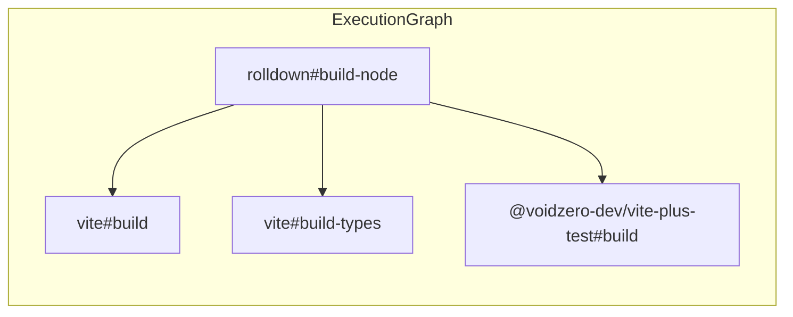
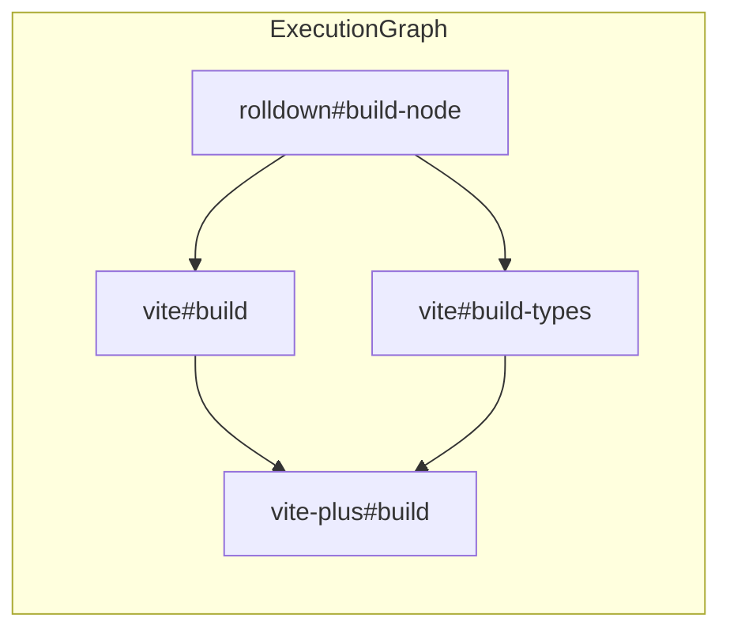
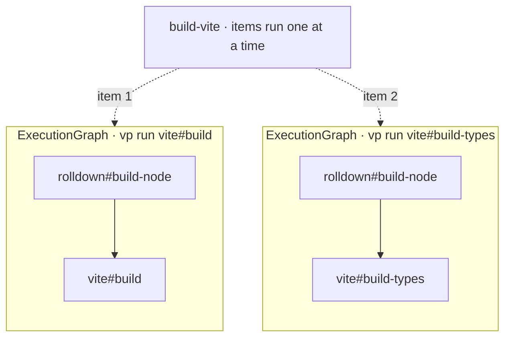
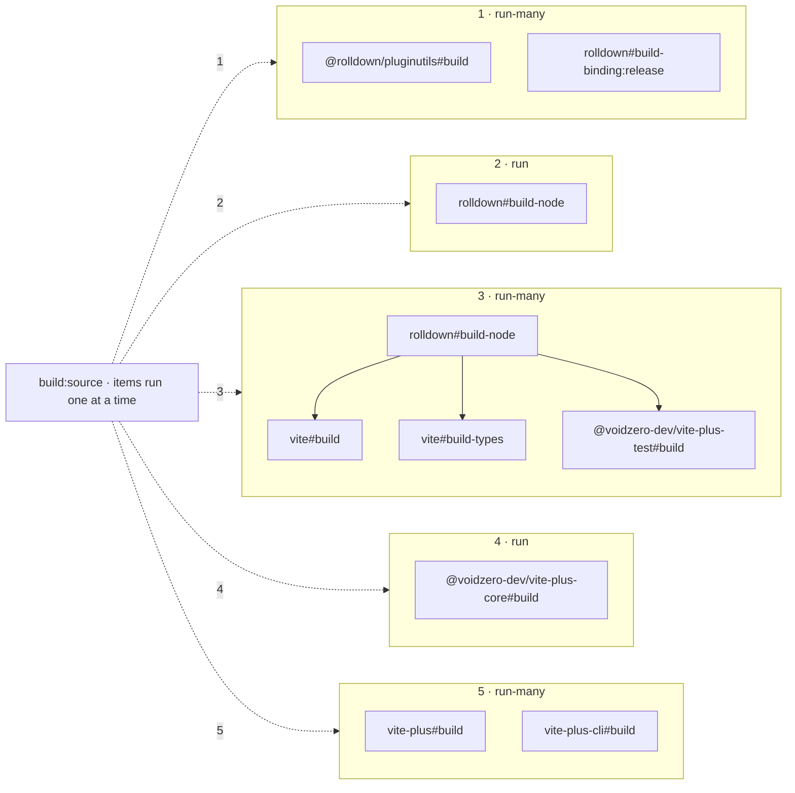

# RFC: `run-many`

## What `run-many` does

`vp run-many <task1> <task2> ...` builds one graph with multiple requested tasks. Which `run` flags are accepted is TBD. The graph is the union of the per-task graphs, deduped by node.

An alternative spelling, `vp run --many <task1> <task2> ...`, is also on the table — same semantics, just a flag on the existing `run` subcommand instead of a new one. This RFC uses `run-many` throughout for clarity.

`vp run-many vite#build vite#build-types @voidzero-dev/vite-plus-test#build`, where all three depend on `rolldown#build-node`:



- **In sequence:** `rolldown#build-node` runs first.
- **In parallel:** once it's done, all three vite tasks run together (up to the concurrency limit).

This is the schedule you can't get from existing primitives:

- `["vp run vite#build", "vp run vite#build-types", "vp run @voidzero-dev/vite-plus-test#build"]` serializes the three.
- `vp run --parallel ...` only takes one task and would drop the dependency edges entirely.

The rest of this RFC explains where `run-many` fits in the existing scheduling model.

## Requests this addresses

- [vite-plus discussions#1523](https://github.com/voidzero-dev/vite-plus/discussions/1523) — run `check`, `lint`, and `typecheck` together. Today the workaround is a wrapper task whose `dependsOn` lists all three. With `run-many`: `vp run-many check lint typecheck`.

- [vite-task#323](https://github.com/voidzero-dev/vite-task/issues/323) — wanted `unit:a` and `unit:b` (both depending on a shared task) in parallel; the workaround was wrapper tasks each calling `vp run unit:X`, which produced two isolated graphs and raced on the shared dep. With `run-many`: `vp run-many unit:a unit:b` — one graph, shared task deduped.

## Two scheduling structures

vite-task schedules work using two structures nested inside each other: a **graph** (what the scheduler runs) and a **tree** (recursion of graphs).

### Graph

An `ExecutionGraph` is a DAG of tasks. The scheduler walks it: a task starts once all of its dependencies have finished, and the number of tasks running at the same time is capped by the concurrency limit (default 4).

`vp run vite-plus#build`, where `vite-plus#build` depends on `vite#build` and `vite#build-types`, both of which depend on `rolldown#build-node`:



Arrows mean "runs before".

- **In sequence:** `rolldown#build-node` first, then the vite tasks, then `vite-plus#build`.
- **In parallel:** `vite#build` and `vite#build-types` run together after `rolldown#build-node`.

`run-many` widens this kind of graph by letting several tasks be the requested roots instead of one.

### Tree

A task's `command` splits on `&&` into **items** that run one after another. An item is either a leaf process, or `Expanded`: a nested `ExecutionGraph` built from a `vp run` inside the command. Every `Expanded` item is its own independent scheduling unit.

After [#381](https://github.com/voidzero-dev/vite-task/issues/381), `command: ["vp run a", "vp run b"]` is shorthand for `"vp run a && vp run b"`. So `string[]` is how you sequence siblings in the tree.

```jsonc
"build-vite": {
  "command": [
    "vp run vite#build",
    "vp run vite#build-types"
  ]
}
```



- **In sequence:** item 1 finishes completely, then item 2 starts.
- **In parallel:** nothing. `vite#build` and `vite#build-types` are independent, but `&&` walls them off from each other.

(Cache will spare you the repeated `rolldown#build-node` work, but the two vite tasks themselves still wait for each other.)

## Composition

`string[]` for sequencing, `run-many` for fan-out:

```jsonc
{
  "build:source": {
    "command": [
      "vp run-many @rolldown/pluginutils#build rolldown#build-binding:release",
      "vp run rolldown#build-node",
      "vp run-many vite#build vite#build-types @voidzero-dev/vite-plus-test#build",
      "vp run @voidzero-dev/vite-plus-core#build",
      "vp run-many vite-plus#build vite-plus-cli#build"
    ]
  }
}
```



- **In sequence:** stages 1 → 2 → 3 → 4 → 5. Each stage finishes completely before the next begins.
- **In parallel within each stage:**
  - Stage 1: `@rolldown/pluginutils#build` and `rolldown#build-binding:release` run together.
  - Stage 2: one task on its own.
  - Stage 3: `rolldown#build-node` gets pulled in as a dep first (a cache hit, since stage 2 already ran it), then `vite#build`, `vite#build-types`, and `@voidzero-dev/vite-plus-test#build` run together.
  - Stage 4: one task on its own.
  - Stage 5: `vite-plus#build` and `vite-plus-cli#build` run together.

Notice that `rolldown#build-node` shows up in both stage 2 and stage 3. Each `vp run` / `vp run-many` builds its own isolated graph and pulls in whatever dependencies its requested tasks declare. The same task can appear in many graphs; cache makes sure the duplicate appearance doesn't mean duplicate work.

| Primitive         | Effect                                                 |
| ----------------- | ------------------------------------------------------ |
| `ExecutionGraph`  | Dependency-aware parallelism within one scheduler      |
| `command: [...]`  | Sequence sibling graphs in the tree                    |
| `vp run`          | Spawn one child graph                                  |
| `vp run-many`     | Spawn one wide child graph (multiple requested tasks)  |
