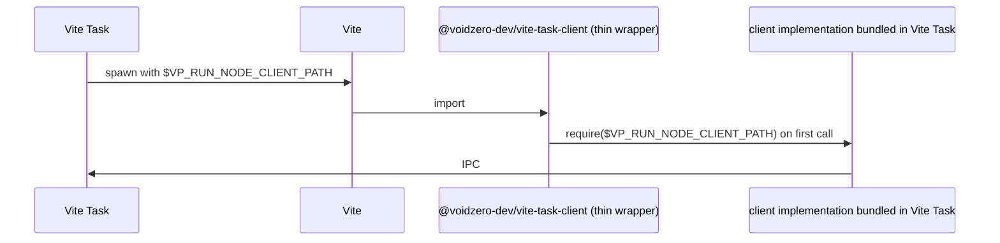

# Proposal: Let Vite Talk to Vite Task

We'd like `vite build` to be cached by Vite Task **correctly** and **with zero user configuration**. This proposal adds a small dependency and a few calls in Vite's codebase to make that possible.

## Background

Vite Task (`vp run` in Vite+) caches a task by tracking three things:

- the files it reads (**inputs**)
- the files it writes (**outputs**)
- the env vars it depends on (**envs**)

Inputs and envs are **fingerprints** of the cache: any change in them triggers a cache miss and a re-run.

Outputs are the main content of the cache: they are **restored on cache hits**.

Vite Task discovers inputs and outputs automatically by **tracking reads and writes at the syscall level**. But envs have to be declared in the task config; Vite Task only passes declared envs through to the child process, so **undeclared envs are invisible to the task** and don't affect caching.

A typical task config looks like this:

```json
{
  "tasks": {
    "build": {
      "command": "build-script",
      "cache": true,
      // The user doesn't have to declare inputs and outputs.
      // But they does have to declare envs. Vite Task can't track what envs a task reads.
      "env": ["APP_*"]
    }
  }
}
```

## Motivation

The goal of this proposal is to cache `vite build` **correctly**, and with **zero manual cache config**.

Vite Task needs the Vite process to communicate two things:

- Which file reads and writes are **internal** (the task's own cache) rather than real inputs or outputs;
- Which envs the task **actually needs** at runtime.

## Cases && Proposed Changes

We want to add a small dependency `@voidzero-dev/vite-task-client` to Vite that lets it talk to Vite Task at runtime. Vite calls into the client at the relevant code paths to declare "ignore this path as an input/output" or "fetch these envs from Vite Task". The calls **are no-ops when Vite runs outside Vite Task**.

### 1. Reading envs according to `envPrefix`

Vite's [`envPrefix`](https://vite.dev/config/shared-options#envprefix) exposes any env matching the prefix (`VITE_*` by default) to the client bundle via `import.meta.env`.

**Current State**: For Vite Task to forward these envs to the build and fingerprint them, the user has to declare them in Vite Task config:

```jsonc
// Vite Task config
{ "tasks": { "build": { "command": "vite build", "env": ["VITE_*"] } } }
```

This task config duplicates `envPrefix`. The two configs currently have to be maintained in sync by the user. Forgetting to do so silently produces incorrect bundles (because the `VITE_*` envs won't be passed to Vite).

**Proposed Changes**:

Add a call to `vite-task-client`'s `getEnvs` **before reading the envs matching `envPrefix`**. If Vite is running outside Vite Task, this calls is a no-op. If Vite is running inside Vite Task, it does two things:

- It tells Vite Task which envs are relevant to the build, so they **become part of the cache fingerprint**.
- It **populates `process.env`** with those envs, so Vite can see them.

```diff
--- a/packages/vite/src/node/env.ts
+++ b/packages/vite/src/node/env.ts
@@ loadEnv(mode, envDir, prefixes = 'VITE_') {
   const parsed = Object.fromEntries(...);
   for (const [key, value] of Object.entries(parsed))
     if (prefixes.some(p => key.startsWith(p))) env[key] = value;
+  for (const prefix of prefixes) getEnvs(`${prefix}*`, { tracked: true });
   for (const key in process.env)
     if (prefixes.some(p => key.startsWith(p))) env[key] = process.env[key];
```

### 2. Pre-bundling deps in `cacheDir`

Vite's dep optimizer reads metadata from and writes pre-bundled deps into [`cacheDir`](https://vite.dev/config/shared-options#cachedir) (default `node_modules/.vite/`).

**Current State**: Vite Task sees these reads and writes, and **treats them as the task's inputs and outputs**. But they're in fact neither: `cacheDir` is the dep optimizer's internal state. The user has to exclude the directory out of both lists manually:

```jsonc
// Vite task config
{
  "input": [{ "auto": true }, { "pattern": "!node_modules/.vite/**", "base": "workspace" }],
  "output": [{ "auto": true }, { "pattern": "!node_modules/.vite/**", "base": "workspace" }],
}
```

And `cacheDir` is user-configurable, so the path in this config has to match whatever the user set.

**Proposed Changes**:

Add two calls **right after resolving `depsCacheDir`**. If Vite is running outside Vite Task, these calls are no-ops. If Vite is running inside Vite Task, they do two things:

- They tell Vite Task to **not treat reads in this directory as inputs**.
- They tell Vite Task to **not treat writes in this directory as outputs**.

```diff
--- a/packages/vite/src/node/optimizer/index.ts
+++ b/packages/vite/src/node/optimizer/index.ts
@@ loadCachedDepOptimizationMetadata(environment, force) {
   const depsCacheDir = getDepsCacheDir(environment);
+  ignoreInput(depsCacheDir);
+  ignoreOutput(depsCacheDir);
```

### 3. Cleaning `outDir` before writing the bundle

Before writing the bundle, Vite calls [`emptyDir(outDir)`](https://github.com/vitejs/vite/blob/v8.0.8/packages/vite/src/node/plugins/prepareOutDir.ts#L69), which `readdirSync`s the directory to list entries for deletion. Then the bundler writes new files to the same directory.

**Current State**: Vite Task sees `dist/` as both an input (the cleanup read) and an output (the bundle write). The user has to exclude `dist/**` from inputs while keeping it declared as an output. And [`build.outDir`](https://vite.dev/config/build-options#build-outdir) is user-configurable, so the path in this config has to match whatever the user set.

**Proposed Changes**:

Add a call **before `emptyDir`**. If Vite is running outside Vite Task, this call is a no-op. If Vite is running inside Vite Task, it tells Vite Task to **not treat reads in this directory as inputs**.

```diff
--- a/packages/vite/src/node/plugins/prepareOutDir.ts
+++ b/packages/vite/src/node/plugins/prepareOutDir.ts
@@ prepareOutDir(outDirs, emptyOutDir, environment) {
   for (const outDir of outDirs) {
+    ignoreInput(outDir);
     if (emptyOutDir !== false && fs.existsSync(outDir)) emptyDir(outDir, ...);
```

### 4. Globbing files in `import.meta.glob`

`import.meta.glob('src/**/*.ts')` lets users import every file matching a pattern. Vite expands the pattern with `tinyglobby`, which reads directory entries under `src/` and filters down to files matching `*.ts`.

**Current State**: Vite Task sees the directory entry reads but not the filter. For `src/**/*.ts`, it knows that the entries of every directory under `src/` are read, but doesn't know that only `.ts` files matter to Vite. Adding or removing any file under `src/` (say a `.md` file the build wouldn't have picked up) invalidates the cache.

**Proposed Changes**:

Add a `glob` function to `@voidzero-dev/vite-task-client`. The first two arguments are the same patterns and options as `tinyglobby`'s `glob`; the third is the original `tinyglobby.glob` itself, used as the fallback when called outside Vite Task. Passing the fallback in keeps `tinyglobby` out of `@voidzero-dev/vite-task-client`'s dependencies.

When called inside Vite Task, Vite Task does the globbing itself and returns the matching paths; the patterns and the matched paths become the fingerprint input, so only changes that would have affected the match-set invalidate the cache. When called outside Vite Task, it just calls the fallback, so behaviour is unchanged for direct `vite build` invocations.

```diff
--- a/packages/vite/src/node/plugins/importMetaGlob.ts
+++ b/packages/vite/src/node/plugins/importMetaGlob.ts
-import { glob } from 'tinyglobby'
+import { glob as tinyglobbyGlob } from 'tinyglobby'
+import { glob } from '@voidzero-dev/vite-task-client'

   const files = (
-    await glob(globsResolved, { /* tinyglobby options */ })
+    await glob(globsResolved, { /* tinyglobby options */ }, tinyglobbyGlob)
   ).filter(...).sort()
```

## Details of `@voidzero-dev/vite-task-client` package

`@voidzero-dev/vite-task-client` is a [small ESM package](https://github.com/voidzero-dev/vite-task/blob/runner-aware-tools/packages/vite-task-client/index.js) (~80 lines, no native code, no transitive deps). Its API is five functions:

```ts
declare module '@voidzero-dev/vite-task-client' {
  export function ignoreInput(path: string): void;
  export function ignoreOutput(path: string): void;
  export function disableCache(): void;
  export function getEnv(name: string, opts?: { tracked?: boolean }): void;
  export function getEnvs(pattern: string, opts?: { tracked?: boolean }): Record<string, string>;
  // Same patterns and options as `tinyglobby`'s `glob`. The third
  // argument is the fallback used when called outside Vite Task; passing
  // it in keeps `tinyglobby` out of this package's dependencies.
  export function glob(
    patterns: string | string[],
    options: GlobOptions,
    fallback: (patterns: string | string[], options: GlobOptions) => Promise<string[]>,
  ): Promise<string[]>;
}
```

`getEnv` / `getEnvs` populate `process.env` for names Vite Task knows about and that aren't already set, so callers read values back via `process.env[...]` as usual.

### Runtime mechanics

The package is a thin wrapper. The wire protocol and IPC transport live in a node module **shipped with Vite Task**. At task start, Vite Task exports that module's path to tasks via an env var; the `@voidzero-dev/vite-task-client` wrapper lazy-requires it on first call.



The thin-wrapper design has two benefits:

- **Light logic bundled in Vite.** Only the lazy-load shim ships with Vite. The wire protocol and `node_client` ship with Vite Task.
- **Vite Task can evolve the IPC freely.** The wire protocol and `node_client`'s APIs can change in Vite Task without requiring a new Vite release. Old Vite versions keep working as long as the wrapper's public surface stays stable.

If the env var is absent (e.g. `vite build` run directly, without Vite Task) or the addon fails to load, every exported function silently no-ops. Vite's behaviour is unchanged outside Vite Task.

## Future additions

This proposal covers the cases that demonstrate the high-level approach. The exact shape of the client APIs and any additional call sites can be discussed and added progressively once the high-level approach is agreed on.

Two examples of what could come next:

- **Call `disableCache()` in dev.** `vite dev` could opt the task out of caching completely.
- **Plugin-owned cache dirs.** Any plugin with its own read/write cache could declare it with `ignoreInput`/`ignoreOutput` instead of asking every user to declare them in Vite Task config.

## Alternatives considered

- **Detect `vite build` and configure its cache in Vite+.**
  - `envPrefix`, `cacheDir`, and `outDir` can be dynamically computed in `vite.config.ts`. Vite+ would have to execute the config to know their values.
  - Other similar cases may exist or appear in future Vite versions. Vite+ would have to learn each one's semantics and handle them case by case. It'd be easier to maintain them alongside the related code in Vite itself.

- **Patch the Vite bundled in Vite+.**
  - **Logic locality.** Each call belongs next to the Vite code that owns its path; patching from outside puts them somewhere else.
  - Users with a self-installed Vite (not the Vite+ bundled one) would get no benefit.

- **Implement this in a Vite plugin**
  - The plugin doesn't have the enough hooks to cover all cases (fetch envs for `envPrefix`).
  - Enhancing the plugin API to cover all cases would be a much bigger impact on Vite.
